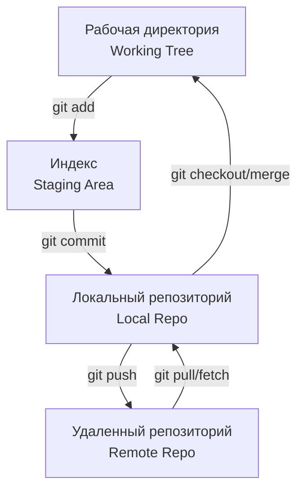

# 00 Основы Git: Спасение от хаоса версий

## История из DevOps
**Боль:** Команда из 5 разработчиков правила одни и те же скрипты на production-сервере через `nano`. В итоге кто-то затер фикс базы данных, а бекапы оказались недельной давности. 
**Решение:** Внедрение Git как единого источника истины (SSOT). Теперь каждое изменение трекается, ревьюится и откатывается одной командой, а деплой автоматизирован.

## Архитектура


## Примеры
**Bash: Базовый воркфлоу**
```bash
# Инициализация и настройка
git init
git config --global user.name "DevOps Engineer"

# Создание фиче-ветки
git checkout -b feature/db-migration

# Фиксация изменений
git add db_schema.sql
git commit -m "feat: update db schema for v2"

# Отправка и интеграция
git push origin feature/db-migration
```

**YAML: CI/CD Pipeline (GitLab CI)**
```yaml
stages:
  - lint
  - test

lint_code:
  stage: lint
  script:
    - echo "Linting code..."
    - git diff --check # Базовая проверка на пробелы

test_branch:
  stage: test
  only:
    - merge_requests
  script:
    - echo "Testing branch ${CI_COMMIT_REF_NAME}"
```

## Day 2 Operations (Эксплуатация)
- **Сквошинг коммитов (Squash):** Очистка истории перед слиянием (`git rebase -i HEAD~N`).
- **Поиск багов (Bisect):** Бинарный поиск коммита, сломавшего билд (`git bisect start; git bisect bad; git bisect good <commit>`).
- **Синхронизация:** Управление конфликтами слияния при параллельной разработке длинных веток (cherry-pick, rebase).

## Антипаттерны
- ❌ **Коммиты типа "fix", "update", "wip":** Невозможно понять, что изменено. Используйте Conventional Commits.
- ❌ **Хранение секретов в репозитории:** Утекшие пароли в истории Git. (Используйте `git-crypt` или SOPS).
- ❌ **Push прямо в master/main:** Отсутствие код-ревью и автоматических проверок (CI).
- ❌ **Гигантские монолитные коммиты:** Затрудняют ревью и откат (revert) изменений.
