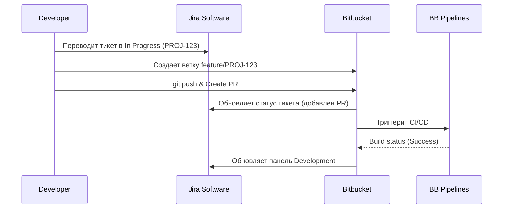

# Bitbucket

## История DevOps: Решение боли эксплуатации
**Боль:** Крупные enterprise-команды использовали экосистему Atlassian (Jira для задач, Confluence для документации), но для работы с кодом применяли сторонние инструменты. Это приводило к рассинхронизации: было сложно понять, какой коммит или релиз закрывает конкретную задачу в Jira, и кто ответственный.
**Решение:** Bitbucket (особенно в связке с Bitbucket Pipelines) обеспечил нативную, "бесшовную" интеграцию с Atlassian-стеком. Упоминание номера тикета в коммите автоматически связывает код, ветку, PR и статус сборки с задачей в Jira, давая менеджерам и инженерам единый контекст.

## Архитектура и Workflow


## Примеры (YAML/Bash)

**Базовый `bitbucket-pipelines.yml`:**
```yaml
image: node:18

pipelines:
  default:
    - step:
        name: Build and Test
        caches:
          - node
        script:
          - npm ci
          - npm test
        artifacts:
          - dist/**
  branches:
    main:
      - step:
          name: Deploy to Production
          deployment: production
          script:
            - pipe: atlassian/aws-s3-deploy:1.1.0
              variables:
                AWS_ACCESS_KEY_ID: $AWS_ACCESS_KEY_ID
                AWS_SECRET_ACCESS_KEY: $AWS_SECRET_ACCESS_KEY
                AWS_DEFAULT_REGION: 'us-east-1'
                S3_BUCKET: 'my-prod-bucket'
                LOCAL_PATH: 'dist'
```

**Работа с API (поиск PR):**
```bash
curl -X GET -u username:app_password \
  "https://api.bitbucket.org/2.0/repositories/workspace/repo/pullrequests"
```

## Day 2 Operations (Эксплуатация)
1. **Оптимизация билд-минут:** Bitbucket Pipelines тарифицируется по минутам. Day 2 включает профилирование пайплайнов, внедрение кэширования и использование собственных (self-hosted) раннеров для тяжелых задач, чтобы не сжигать лимиты.
2. **Управление доступом:** Настройка Branch Permissions (запрет push в main, обязательные аппрувы, успешные билды) и интеграция с SSO/SAML через Atlassian Access.
3. **Обслуживание LFS (Large File Storage):** Очистка устаревших бинарных файлов и мониторинг квоты хранилища, так как Bitbucket строго лимитирует размер репозиториев (обычно до 2GB на облако).
4. **Управление токенами:** Ротация App Passwords и OAuth токенов, используемых для внешних интеграций.

## Антипаттерны
- **Игнорирование Pipes:** Написание сложных bash-скриптов для деплоя вместо использования готовых абстракций (Bitbucket Pipes), которые поддерживаются вендорами (AWS, GCP, Slack).
- **Разрыв связи с Jira:** Коммиты и ветки без указания ID задачи (например, `git commit -m "fix bug"` вместо `git commit -m "PROJ-123: fix auth bug"`), что ломает всю суть экосистемы.
- **Хранение секретов в коде:** Вместо использования Repository/Workspace Variables и secured-переменных, хардкод ключей AWS прямо в `bitbucket-pipelines.yml`.
- **Огромные монолитные репозитории:** Bitbucket (в облачной версии) может тормозить с гигантскими монорепами. Отсутствие стратегии разбиения (multi-repo) или использования Git LFS для бинарников.
