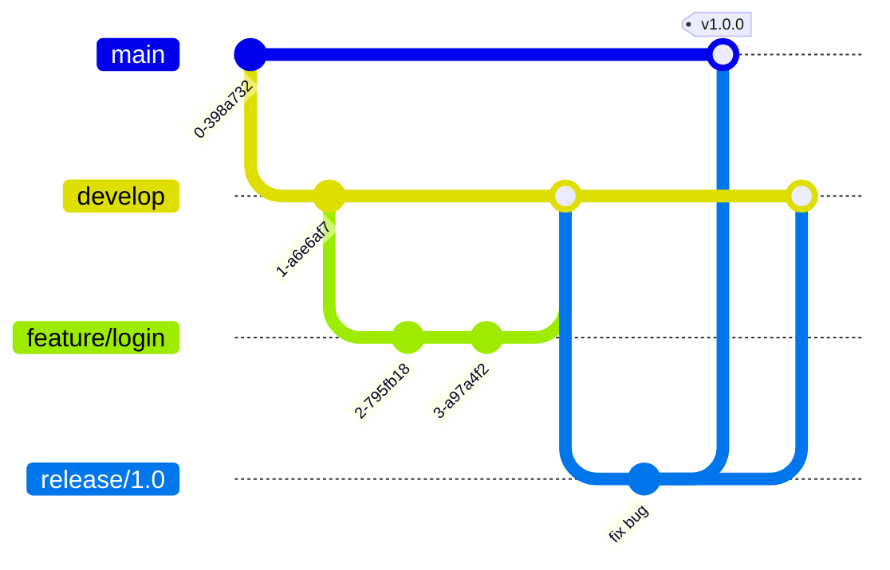
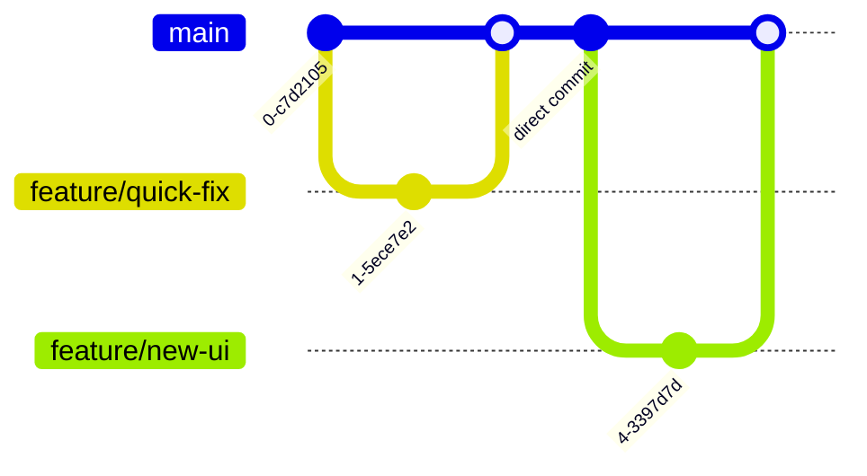

# Branching Strategies (GitFlow, TBD)

## 📖 DevOps Story (Боль)
**Боль:** Релизы шли раз в месяц, собирались из 15 веток (merge hell), часть фичей терялась, а на проде всплывали баги из-за рассинхрона окружений. Команда тратила дни на разрешение конфликтов вместо написания кода.
**Решение:** Стандартизация работы с ветками. Переход от громоздкого GitFlow к Trunk-Based Development (TBD) с Feature Flags позволил выкатываться каждый день без боли.

## 📐 Архитектура (Mermaid)

### GitFlow (Классика)


### Trunk-Based Development (Современный подход)


## 🛠️ Примеры реализации

### TBD CI/CD pipeline (GitLab CI)
```yaml
stages:
  - build
  - test
  - deploy

variables:
  FF_NETWORK_PER_BUILD: "true"

build_job:
  stage: build
  script:
    - make build
  only:
    - main
    - merge_requests

test_job:
  stage: test
  script:
    - make test
  only:
    - main
    - merge_requests

deploy_prod:
  stage: deploy
  script:
    - helm upgrade my-app ./chart
  only:
    - main
```

### Настройка защиты ветки (Bash + GitHub CLI)
```bash
# Включаем защиту ветки main в Trunk-Based
gh api -X PUT /repos/{owner}/{repo}/branches/main/protection \
  -F required_status_checks[strict]=true \
  -F required_status_checks[contexts][]=ci/test \
  -F enforce_admins=true \
  -F required_pull_request_reviews[required_approving_review_count]=1
```

## 🌅 Day 2 Operations
- **Регулярная чистка веток:** Настройка CI-джобы или бота (например, GitHub Actions `Delete merged branches`) для удаления слитых `feature/*` веток.
- **Мониторинг Feature Flags:** TBD часто требует Feature Flags. Важно следить за их актуальностью и удалять старые флаги из кода и систем управления (LaunchDarkly, Unleash).
- **Метрики DORA:** Отслеживание Lead Time for Changes. При успешном внедрении TBD этот показатель должен радикально снизиться.

## ❌ Антипаттерны
- **Long-lived feature branches:** Жизнь ветки дольше 2-3 дней. Приводит к конфликтам слияния (Merge Hell).
- **Release-ветки в TBD:** Попытка создать "стабилизационную" ветку, ломающая суть транк-бейсд подхода.
- **Прямые коммиты в main (без ревью):** Даже в TBD изменения должны идти через короткие Pull/Merge Requests (Short-Lived Branches) с автоматическими проверками.
- **Смешивание стратегий:** Использование GitFlow для бэкенда и TBD для фронтенда в рамках одного монорепозитория.
