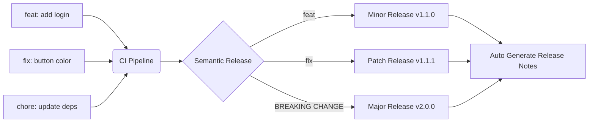

# Conventional Commits

## 📖 DevOps Story (Боль)
**Боль:** История коммитов выглядела как "fix", "wip", "упс", "asdfg". Сборка Release Notes занимала часы, семантическое версионирование (SemVer) проставлялось наугад, а откат неудачного деплоя требовал чтения кода, чтобы понять, какой коммит всё сломал.
**Решение:** Внедрение спецификации Conventional Commits + Semantic Release. Теперь ченджлоги генерируются сами, версии бампаются автоматически, а история читается как книга.

## 📐 Архитектура (Mermaid)



## 🛠️ Примеры реализации

### Хук commit-msg (Bash)
Простой хук для проверки формата коммита локально:
```bash
#!/usr/bin/env bash
# .git/hooks/commit-msg

commit_regex='^(feat|fix|docs|style|refactor|perf|test|build|ci|chore|revert)(\([a-z0-9\-]+\))?:\s.+$'
error_msg="Aborting commit. Your commit message is invalid. Expected format: type(scope): subject"

if ! grep -iqE "$commit_regex" "$1"; then
    echo "$error_msg" >&2
    exit 1
fi
```

### CI/CD Интеграция с Semantic Release (GitHub Actions)
```yaml
name: Release
on:
  push:
    branches:
      - main
jobs:
  release:
    name: Release
    runs-on: ubuntu-latest
    steps:
      - name: Checkout
        uses: actions/checkout@v3
        with:
          fetch-depth: 0
      - name: Setup Node.js
        uses: actions/setup-node@v3
        with:
          node-version: '18'
      - name: Release
        env:
          GITHUB_TOKEN: ${{ secrets.GITHUB_TOKEN }}
        run: npx semantic-release
```

## 🌅 Day 2 Operations
- **Onboarding:** Обучение новых разработчиков использованию утилит вроде `commitizen` (cz-cli) для интерактивного формирования правильных коммитов.
- **Поддержка Scope:** Ведение и актуализация списка допустимых `scope` для проекта (например, `ui`, `db`, `api`), чтобы избежать зоопарка скоупов.
- **Squash and Merge:** Настройка репозитория на принудительный "Squash and Merge" при принятии PR. Сам PR должен иметь Conventional заголовок, который станет единственным коммитом в main.

## ❌ Антипаттерны
- **Огромные коммиты:** Один коммит `feat: everything` на 5000 строк кода. Conventional Commits не спасет, если сам коммит не атомарный.
- **Игнорирование BREAKING CHANGE:** Внесение обратно несовместимых изменений под видом `fix` или `feat` без восклицательного знака (`feat!: ...`) или футера `BREAKING CHANGE:`. Ломает автоматическое мажорное версионирование.
- **Фейковые типы:** Использование своих типов (`wip:`, `stuff:`) вместо стандартных, что ломает парсинг утилитами релизов.
- **Слишком длинные описания в заголовке:** Заголовок длиннее 50-72 символов. Подробности должны идти в body коммита, через пустую строку.
