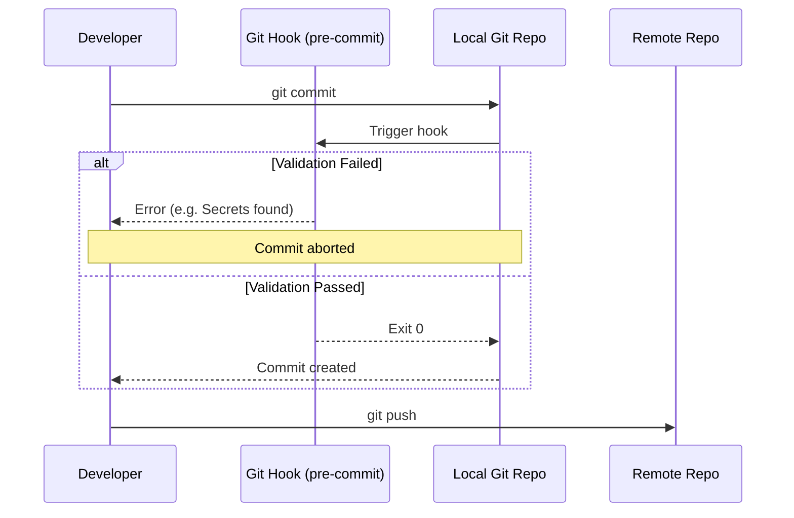

# Git Hooks

## 📖 История из окопов (DevOps Story)
**Боль:** Разработчики регулярно коммитили хардкоднутые пароли, неформатированный код и синтаксические ошибки. CI-пайплайны падали через 10 минут работы, тратя вычислительные ресурсы и время всей команды.  
**Решение:** Внедрение клиентских Git-хуков (pre-commit, pre-push) для локальной валидации кода до того, как он попадет на сервер. Быстрая обратная связь и защита от "глупых" ошибок сдвинулись влево (Shift Left).

## 🗺️ Архитектура



## 💻 Примеры (Bash & YAML)

### Нативный Bash скрипт (сохранить в `.git/hooks/pre-commit`)
Простая проверка на наличие слова "password":
```bash
#!/bin/bash
# Запрет коммита, если найдено слово "password"

if git rev-parse --verify HEAD >/dev/null 2>&1
then
    AGAINST=HEAD
else
    # Начальный коммит: сравнение с пустым деревом
    AGAINST=4b825dc642cb6eb9a060e54bf8d69288fbee4904
fi

# Ищем изменения
FORBIDDEN="password"
if git diff-index -p -M --cached $AGAINST | grep -qi "$FORBIDDEN"; then
    echo "❌ ОШИБКА: Найдены потенциальные секреты ('$FORBIDDEN'). Коммит отменен."
    exit 1
fi

echo "✅ Проверка пройдена."
exit 0
```

### Современный подход: Фреймворк `pre-commit` (YAML конфигурация)
Файл `.pre-commit-config.yaml` в корне репозитория:
```yaml
repos:
-   repo: https://github.com/pre-commit/pre-commit-hooks
    rev: v4.4.0
    hooks:
    -   id: trailing-whitespace
    -   id: end-of-file-fixer
    -   id: check-yaml
-   repo: https://github.com/Yelp/detect-secrets
    rev: v1.4.0
    hooks:
    -   id: detect-secrets
```
*Установка: `pip install pre-commit && pre-commit install`*

## 🛠️ Day 2 Operations (Эксплуатация)
1. **Синхронизация хуков в команде:** 
   - По умолчанию папка `.git/hooks` не версионируется.
   - Решение: хранить скрипты в папке `scripts/hooks` и настраивать путь через `git config core.hooksPath scripts/hooks` (или использовать фреймворк `pre-commit`).
2. **Обход хуков в экстренных случаях:** 
   - Если хук ложно срабатывает, разработчик может использовать флаг `--no-verify` (`git commit -m "fix" --no-verify`). Использовать только при крайней необходимости!
3. **Обновление версий:** Регулярный запуск `pre-commit autoupdate` для обновления версий линтеров в YAML-файле.

## ⚠️ Антипаттерны
- **Долгие тесты в pre-commit:** Запуск полных E2E-тестов на хуке. Коммит должен быть быстрым (секунды, не минуты). Долгие проверки оставьте для CI.
- **Завязка на локальное окружение:** Использование жестких путей (абсолютных путей) или утилит, которые есть только на Mac/Linux, ломая работу пользователям Windows.
- **Отсутствие CI-дублирования:** Использование хуков как *единственной* линии защиты. Хуки можно обойти (`--no-verify`). Серверный CI должен проверять всё то же самое.
