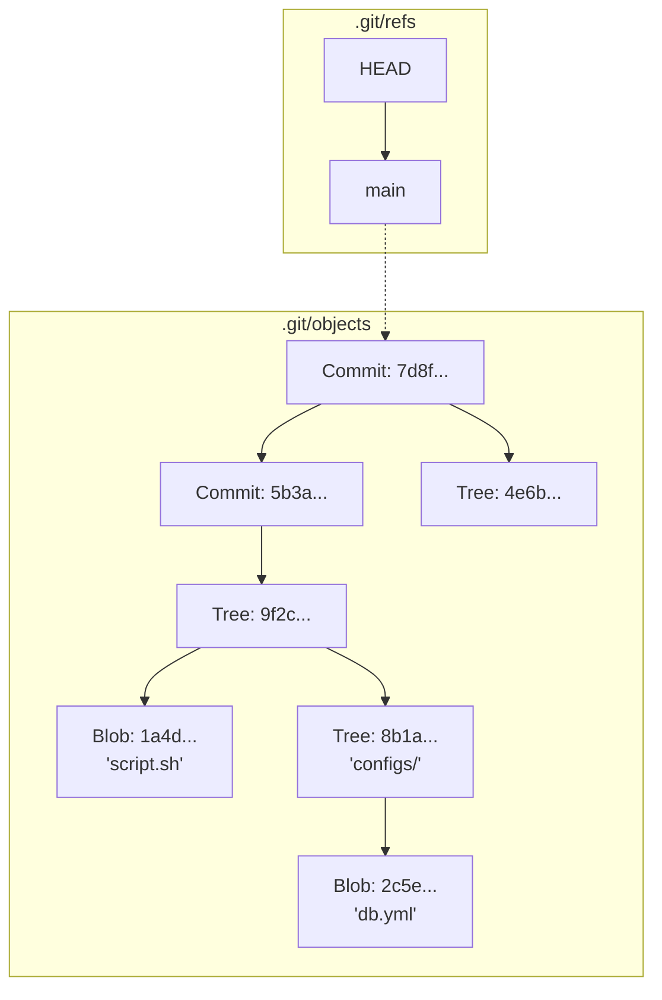

# Git Internals: Взгляд под капот

## История из DevOps
**Боль:** Случайный `git push --force` перезаписал ветку `main`, и разработчики потеряли неделю работы. Никто не знал, как восстановить данные, так как "Git — это просто черная магия".
**Решение:** Понимание того, что Git — это направленный ациклический граф (DAG) и файловая система, адресуемая по контенту. С помощью `git reflog` и знания структуры директории `.git/` команда восстановила утерянные коммиты за 10 минут.

## Архитектура объектов (DAG)


## Примеры
**Bash: Исследование внутренностей**
```bash
# Посмотреть тип объекта по хэшу
git cat-file -t 5b3a8

# Посмотреть содержимое объекта (коммита, дерева, блоба)
git cat-file -p 5b3a8

# Найти "потерянные" коммиты (которые больше не привязаны ни к одной ветке)
git fsck --lost-found

# Восстановить удаленную ветку с помощью reflog
git reflog
git checkout -b recovered-branch HEAD@{2}
```

**YAML: Настройка хуков (pre-commit)**
```yaml
# .pre-commit-config.yaml
repos:
-   repo: https://github.com/pre-commit/pre-commit-hooks
    rev: v4.4.0
    hooks:
    -   id: check-yaml
    -   id: end-of-file-fixer
    -   id: detect-private-key # Защита от коммита секретов (проверка блобов)
```

## Day 2 Operations (Эксплуатация)
- **Сборка мусора (Garbage Collection):** Оптимизация размера репозитория с помощью `git gc`, который упаковывает свободные объекты в pack-файлы.
- **Восстановление данных:** Использование `git reflog` для возврата к "отсоединенным" (dangling) коммитам после неудачного `rebase` или `reset --hard`.
- **Очистка истории (BFG / filter-repo):** Полное удаление случайно закоммиченных бинарников или секретов из всех старых коммитов (переписывание DAG).

## Антипаттерны
- ❌ **Игнорирование папки `.git`:** Случайная публикация `.git` директории на web-сервере (приводит к утечке исходного кода).
- ❌ **Слишком частый `git gc` вручную:** Git сам отлично справляется с фоновой очисткой.
- ❌ **Изменение публичной истории:** Использование `git push --force` для веток, с которыми работают другие люди (ломает их локальные графы).
- ❌ **Хранение огромных бинарников:** Git плохо справляется с версионированием несжимаемых бинарных файлов (блобы пухнут). Для этого нужен Git LFS.
