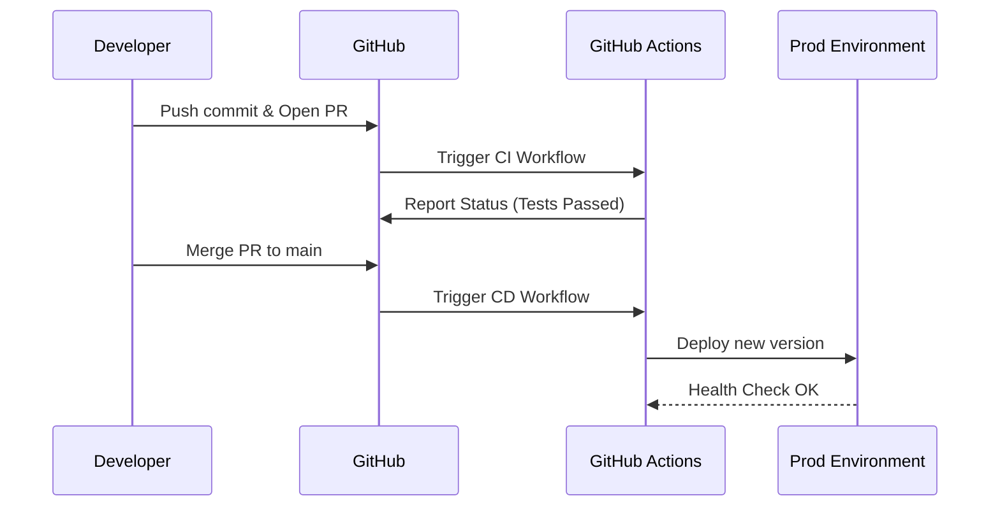

# GitHub (для DevOps)

## 📖 История: От файлопомойки к GitOps

Сначала мы использовали GitHub просто как место для хранения кода. Разработчики пушили код, а DevOps по SSH заходил на сервера и делал `git pull`. Но однажды сервер упал, и никто не помнил, какой коммит там был развернут. 

Мы перешли к концепции GitOps. Теперь GitHub — это единственный источник истины (Single Source of Truth) не только для кода, но и для инфраструктуры. Мы описали инфраструктуру в Terraform, положили в GitHub, и настроили GitHub Actions. Теперь, чтобы добавить сервер, мы делаем Pull Request. Инфраструктура разворачивается автоматически после аппрува, а история всех изменений навсегда остается в Git.

## 📐 Архитектура: GitHub Actions Flow



## 🛠 Примеры (bash / YAML)

**1. Bash: Управление релизами через GitHub CLI (gh)**
```bash
# Авторизация
gh auth login

# Быстрое создание PR прямо из терминала
gh pr create --title "Fix production memory leak" --body "Closes #123"

# Просмотр статуса проверок (CI)
gh pr checks

# Релиз новой версии
gh release create v1.2.0 --notes "Added auto-scaling feature"
```

**2. YAML: Переиспользуемый Workflow (Reusable Workflow)**
```yaml
# .github/workflows/deploy-template.yml
name: Reusable Deploy
on:
  workflow_call:
    inputs:
      environment:
        required: true
        type: string
    secrets:
      KUBECONFIG:
        required: true

jobs:
  deploy:
    runs-on: ubuntu-latest
    environment: ${{ inputs.environment }}
    steps:
      - name: Deploy to K8s
        run: kubectl apply -f k8s/ --kubeconfig <(echo "${{ secrets.KUBECONFIG }}")
```

## 🌅 Day 2 Operations (Повседневная эксплуатация)

- **Безопасность (Dependabot & Secret Scanning):** Автоматическое сканирование на слитые токены (AWS, GCP, NPM) и уязвимые зависимости. Важно вовремя разбирать алерты, иначе они превращаются в "белый шум".
- **Environment Protection Rules:** Настройка деплоя в Production только после аппрува определенных лиц (Release Managers) и успешного прохождения всех интеграционных тестов.
- **Self-hosted Runners:** Если стандартные раннеры GitHub слишком медленные или нет доступа во внутреннюю сеть (VPC), разворачиваются свои runners (например, через ARC - Actions Runner Controller в Kubernetes).

## ⚠️ Антипаттерны

- **God Token:** Использование Personal Access Token (PAT) одного из DevOps-инженеров для всех автоматизаций. Если сотрудник уволится — сломается всё. Решение: GitHub Apps или Deploy Keys.
- **Слепой Merge:** Отсутствие правил `Branch protection`. Любой джуниор может сделать `git push -f origin main`.
- **Локальные секреты в коде:** Коммит файлов `.env` прямо в репозиторий. Секреты должны лежать в GitHub Secrets или во внешнем Vault.
