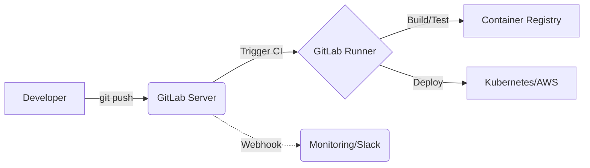

# GitLab

## История DevOps: Решение боли эксплуатации
**Боль:** Команды тратили часы на интеграцию зоопарка инструментов (Jira, Jenkins, GitHub, Artifactory, SonarQube). Поддержка плагинов, управление доступами в разных системах и потеря контекста между тикетом и деплоем превращались в "ад обслуживания".
**Решение:** GitLab предложил концепцию "Single application for the entire DevOps lifecycle" — единая платформа, где код, CI/CD, security scanning и registry находятся в одном месте, с единой моделью доступов (RBAC) и интерфейсом.

## Архитектура и Workflow


## Примеры (YAML/Bash)

**Базовый `.gitlab-ci.yml` с кэшем и артефактами:**
```yaml
stages:
  - build
  - test
  - deploy

variables:
  DOCKER_DRIVER: overlay2

cache:
  paths:
    - node_modules/

build_job:
  stage: build
  image: node:18
  script:
    - npm ci
    - npm run build
  artifacts:
    paths:
      - dist/
    expire_in: 1 week

deploy_job:
  stage: deploy
  script:
    - echo "Deploying to production..."
    - rsync -av dist/ user@server:/var/www/html/
  environment:
    name: production
  only:
    - main
```

**Регистрация раннера:**
```bash
gitlab-runner register \
  --non-interactive \
  --url "https://gitlab.com/" \
  --registration-token "PROJECT_TOKEN" \
  --executor "docker" \
  --docker-image alpine:latest \
  --description "docker-runner"
```

## Day 2 Operations (Эксплуатация)
1. **Runner Management:** Масштабирование раннеров через Kubernetes (GitLab Runner Helm Chart) или AWS Auto Scaling. Мониторинг очередей задач.
2. **Управление артефактами:** Настройка политик очистки (Keep latest artifacts, expiration policies), чтобы предотвратить переполнение диска сервером.
3. **Мониторинг компонентов (для Self-managed):** Отслеживание метрик Sidekiq (очереди фоновых задач), Gitaly (RPC-вызовы к Git), PostgreSQL и Redis через встроенный Prometheus/Grafana.
4. **Обновления:** Строгое следование upgrade path (нельзя перепрыгивать через несколько мажорных/минорных версий).

## Антипаттерны
- **Монолитные пайплайны:** Файл `.gitlab-ci.yml` на 2000 строк вместо использования `include:` для переиспользования логики (шаблонов).
- **Игнорирование кэша и артефактов:** Скачивание зависимостей (npm, maven) с нуля на каждом шаге пайплайна, что замедляет сборку в разы.
- **Root-доступы в раннерах:** Использование shell-раннеров от имени root вместо изолированных docker/kubernetes executor'ов.
- **Отсутствие тэгов у раннеров:** Отправка тяжелых сборок на слабые раннеры, не предназначенные для этого, из-за отсутствия маршрутизации по `tags`.
