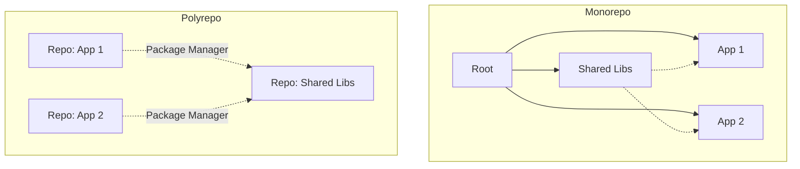

# Monorepo vs Polyrepo

## 📖 История: Боль масштабирования и зависимостей

В начале был стартап, и был один репозиторий. По мере роста команды и микросервисов, мы разделили код на десятки репозиториев (Polyrepo). Сначала это казалось свободой: каждая команда релизит сама. Но вскоре наступил ад версионирования. Библиотека авторизации обновилась в одном месте, но сломала три других сервиса, которые забыли обновить зависимость. 

Тогда мы попробовали Monorepo. Все сервисы и библиотеки живут в одном гигантском репозитории. Обновление библиотеки `auth` теперь требует изменения всех зависимых сервисов в одном коммите (атомарные изменения). CI стал тяжелее, но мы снова обрели уверенность в том, что код компилируется целиком. 

**Вывод:** Polyrepo дает автономию, но усложняет консистентность. Monorepo дает консистентность, но требует серьезных инвестиций в тулинг (Bazel, Nx, Lerna).

## 📐 Архитектура



## 🛠 Пример: CI Pipeline для Monorepo (GitHub Actions)

В монорепе важно запускать тесты только для тех сервисов, которые изменились.

```yaml
# .github/workflows/monorepo-ci.yml
name: Monorepo Smart CI
on: [push]

jobs:
  detect-changes:
    runs-on: ubuntu-latest
    outputs:
      services: ${{ steps.filter.outputs.changes }}
    steps:
      - uses: actions/checkout@v3
      - uses: dorny/paths-filter@v2
        id: filter
        with:
          filters: |
            auth-service: 'services/auth/**'
            billing-service: 'services/billing/**'

  test-changed:
    needs: detect-changes
    if: ${{ needs.detect-changes.outputs.services != '[]' && needs.detect-changes.outputs.services != '' }}
    strategy:
      matrix:
        service: ${{ fromJSON(needs.detect-changes.outputs.services) }}
    runs-on: ubuntu-latest
    steps:
      - uses: actions/checkout@v3
      - run: make test-${{ matrix.service }}
```

## 🌅 Day 2 Operations (Жизнь после внедрения)

1. **Monorepo:**
   - **Ускорение CI:** Кэширование сборок (Bazel/Nx cloud). Если CI идет больше 10 минут, разработчики начинают страдать.
   - **Управление доступом (CODEOWNERS):** Настройка ревью, чтобы изменения в `/lib/core` одобряли только Core Team.
   - **Sparse Checkout:** Разработчики клонируют не все гигабайты репо, а только нужную часть (`git sparse-checkout`).

2. **Polyrepo:**
   - **Синхронизация зависимостей:** Использование Dependabot/Renovate для автоматического раската обновлений общих либ по всем репозиториям.
   - **Шаблонизация CI/CD:** Вынос пайплайнов в общий репозиторий (Shared GitHub Actions / GitLab CI Includes), чтобы не копипастить YAML.

## ⚠️ Антипаттерны

- **Fake Monorepo:** Все проекты лежат в одной папке, но нет общего тулинга для сборки (никто не проверяет зависимости при коммитах).
- **Разделение по слоям (Polyrepo):** Отдельный репо для фронтенда, отдельный для бэкенда, отдельный для базы одной и той же фичи. Итог: фича-ветки в 3 разных репозиториях для релиза одной задачи.
- **Вендоринг всего (Monorepo):** Затягивание исходников всех внешних зависимостей (NPM/PyPi) прямо в Git. Репозиторий раздувается до сотен гигабайт.
