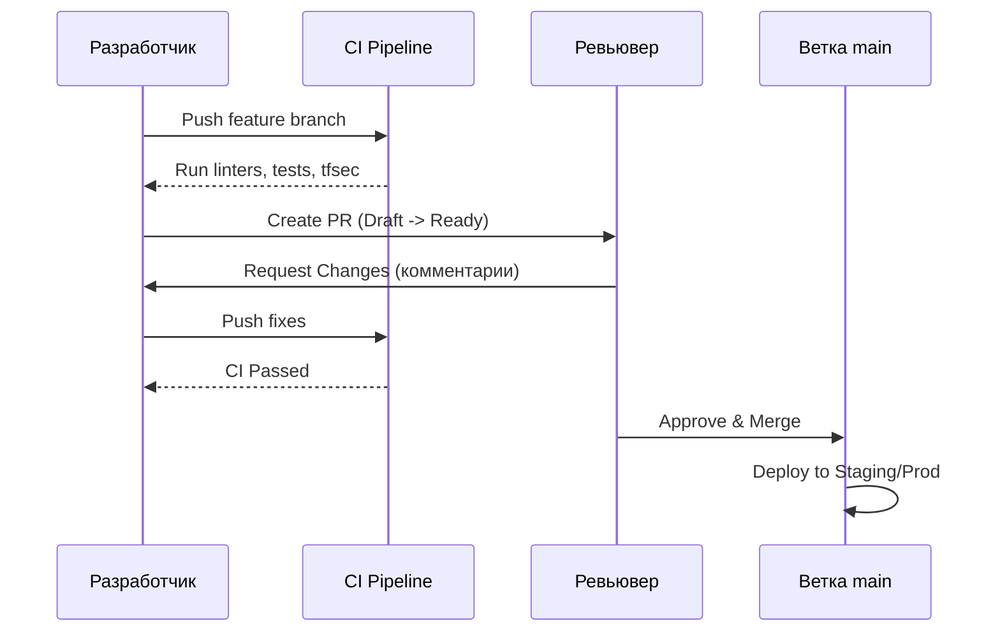

# Pull Requests и Code Review

## Боль эксплуатации
Разработчики пушат код напрямую в `main` или `master`. Неработающий код, захардкоженные креды, неоптимальные SQL-запросы или сломанные Terraform-манифесты мгновенно попадают в пайплайн и ломают инфраструктуру или продакшен. Отсутствие ревью приводит к низкому Bus Factor — знания о системе остаются только в голове автора кода.

## Решение
Внедрение Pull Requests (PR) / Merge Requests (MR) с обязательным Code Review. Код пишется в feature-ветке, проверяется CI-системой и глазами коллег, и только после получения Approval (одобрения) вливается в защищенную (protected) главную ветку.

## Схема процесса (Mermaid)


## Автоматизация (YAML)
Запрет на мердж некачественного кода решается через branch protection rules и обязательные CI-проверки. Пример валидации Terraform через GitHub Actions перед мерджем:

```yaml
name: PR Check
on: [pull_request]
jobs:
  validate:
    runs-on: ubuntu-latest
    steps:
      - uses: actions/checkout@v3
      - name: Setup Terraform
        uses: hashicorp/setup-terraform@v2
      - name: Terraform Fmt
        run: terraform fmt -check
      - name: Terraform Validate
        run: terraform init -backend=false && terraform validate
      - name: TFSec Check
        uses: aquasecurity/tfsec-action@v1.0.0
```

## Day 2 Operations
- **Борьба с застоем (Time to Merge):** Мониторинг метрики времени жизни PR. Внедрение ботов (например, в Slack/Telegram) для автоматических напоминаний ревьюверам о зависших PR.
- **Очистка веток:** Настройка автоматического удаления source-веток после мерджа, чтобы репозиторий не превращался в свалку.
- **DORA Metrics:** PR — это ключевой этап, влияющий на метрику Lead Time for Changes (время от первого коммита до попадания на прод).

## Антипаттерны
- **LGTM (Looks Good To Me) синдром:** Формальный аппрув без вдумчивого чтения кода, лишь бы отстал коллега.
- **Монструозные PR:** Ревьювер физически не может качественно проверить PR на 50+ измененных файлов и 2000 строк кода. Ревью превращается в мучение и пропуск багов. (Решение: дробить задачи).
- **Холивары в комментариях о форматировании:** Споры о пробелах и кавычках. (Решение: внедрение строгих форматтеров типа `black`, `gofmt`, `prettier` в CI/pre-commit хуки).
- **Токсичное ревью:** Критика личности автора, а не кода. Ревью должно улучшать кодовую базу и обучать, а не демотивировать.
