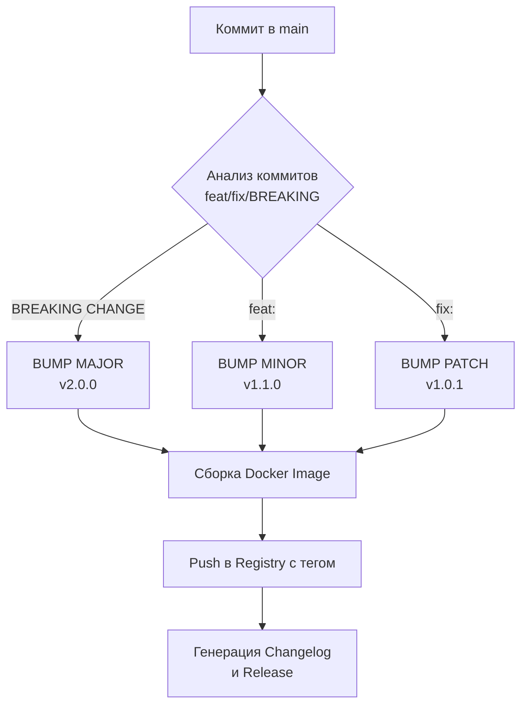

# Semantic Versioning (SemVer)

## Боль эксплуатации
Без строгих правил версионирования релизы непредсказуемо ломают продакшен. Очередной "фикс маленькой баги" в версии `1.2` незаметно приносит несовместимые изменения в API. Итог: сервисы-потребители падают, дебаг занимает часы, доверие к платформе падает, а откаты требуют ручного вмешательства.

## Решение
Внедрение Semantic Versioning. Формат: `MAJOR.MINOR.PATCH` (например, `2.1.4`).
- **MAJOR** — несовместимые изменения (breaking changes).
- **MINOR** — новая функциональность, обратно совместимая.
- **PATCH** — багфиксы, обратно совместимые.

## Схема процесса (Mermaid)


## Автоматизация (Bash/YAML)
Для автоматического расчета версии на основе Conventional Commits часто используют `semantic-release`.

Пример пайплайна в GitHub Actions:
```yaml
name: Release
on:
  push:
    branches:
      - main
jobs:
  release:
    runs-on: ubuntu-latest
    permissions:
      contents: write # Для создания тегов и релизов
      issues: write
      pull-requests: write
    steps:
      - uses: actions/checkout@v3
      - name: Setup Node.js
        uses: actions/setup-node@v3
        with:
          node-version: "lts/*"
      - name: Run Semantic Release
        env:
          GITHUB_TOKEN: ${{ secrets.GITHUB_TOKEN }}
        run: npx semantic-release
```

## Day 2 Operations
- **Graceful Deprecation:** При выпуске новой MAJOR версии необходимо поддерживать старую версию в течение оговоренного grace period для миграции потребителей.
- **Управление артефактами:** Настройка lifecycle policies в Docker Registry для удаления старых pre-release или patch версий, чтобы экономить место, сохраняя только минорные и мажорные "срезы".

## Антипаттерны
- **Mutability тегов:** Перезапись существующего тега (например, `docker push app:v1.0.0` поверх старого). Артефакты должны быть строго immutable!
- **Вечный v0.x.x:** Проект годами живет в версии `0.1.x` на продакшене, потому что "мы еще не готовы к v1". Если это прод — это v1.
- **Использование latest в проде:** Деплой с тегом `:latest` вместо конкретной semver-версии приводит к невозможности отката и непониманию, что сейчас крутится на серверах.
