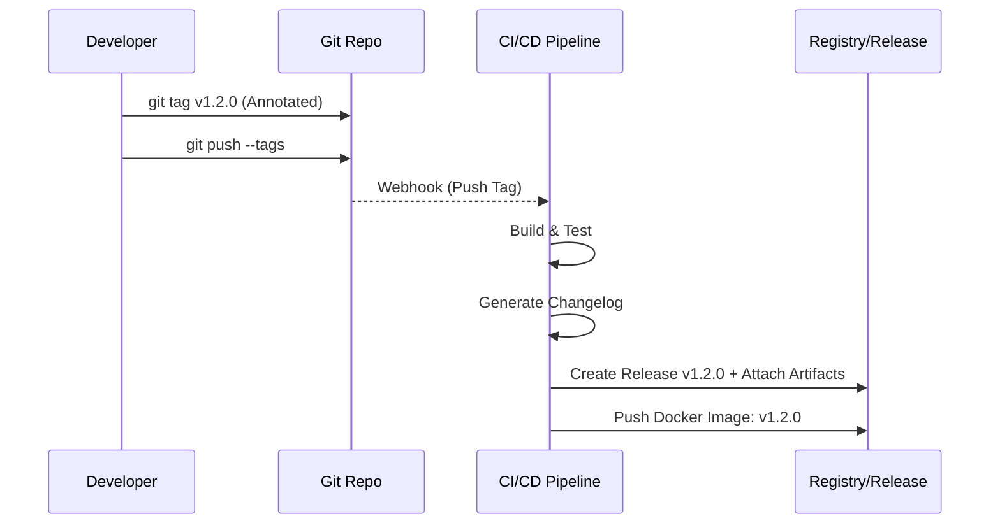

# Tags и Releases

## 📖 DevOps-история (Боль эксплуатации)
**Симптом:** В пятницу вечером падает прод. SRE спрашивает разработчиков: "Какая версия сейчас развернута?". Разработчики отвечают: "Ну, коммит `a1b2c3d` из ветки `main`, который мы пушили в среду". Никто точно не знает, какие фичи и багфиксы вошли в этот коммит, и нет собранного артефакта, к которому можно легко откатиться.
**Решение:** Использование Git Tags для фиксации состояния репозитория и Releases (в GitHub/GitLab) для привязки к этим тегам скомпилированных артефактов и автоматически сгенерированного Changelog-а. Семантическое версионирование (SemVer).

## 📊 Архитектура / Схема (Mermaid)


## 💻 Примеры (Bash/YAML)

**Создание аннотированного тега:**
```bash
# Создаем тег с сообщением (аннотированный)
git tag -a v2.0.1 -m "Release v2.0.1: Fix memory leak in auth module"
# Пушим теги на сервер
git push origin v2.0.1
# или запушить все локальные теги
git push --tags
```

**GitHub Actions YAML для создания релиза:**
```yaml
name: Create Release
on:
  push:
    tags:
      - 'v*.*.*' # Запуск при пуше тега v1.0.0

jobs:
  release:
    runs-on: ubuntu-latest
    steps:
      - uses: actions/checkout@v3
      - name: Build App
        run: make build
      - name: Create GitHub Release
        uses: softprops/action-gh-release@v1
        with:
          files: bin/app-linux-amd64
          generate_release_notes: true
```

## 🛠 Day 2 Operations (Эксплуатация)
* **Автоматизация Changelog:** Использование инструментов вроде Release Please или semantic-release для автоматического создания тегов и релизов на основе коммитов (формат Conventional Commits: `feat:`, `fix:`).
* **Подписание тегов:** Использование GPG ключей для подписи тегов (`git tag -s`), чтобы гарантировать, что релиз создан доверенным CI/CD пайплайном или инженером, защищая цепочку поставок (Supply Chain Security).
* **Очистка старых тегов:** Настройка политик в registry для удаления старых образов, но сохранение тегов в Git для исторической справки (Git-теги почти не занимают места).

## 🚫 Антипаттерны
* **Перемещение тегов (Moving tags):** Перезаписывание существующего тега на другой коммит (`git tag -f`). Если тег `v1.0.0` уже был развернут, его перемещение нарушает воспроизводимость и инвалидирует все кэши и артефакты.
* **Использование Lightweight тегов для релизов:** Создание тегов без `git tag -a`. Легковесные теги — это просто указатели, они не содержат дату создания и автора, что усложняет аудит.
* **Ручная сборка релизов:** Скачивание кода на локальную машину, сборка и ручная загрузка артефактов в GitHub Releases, минуя CI/CD.
