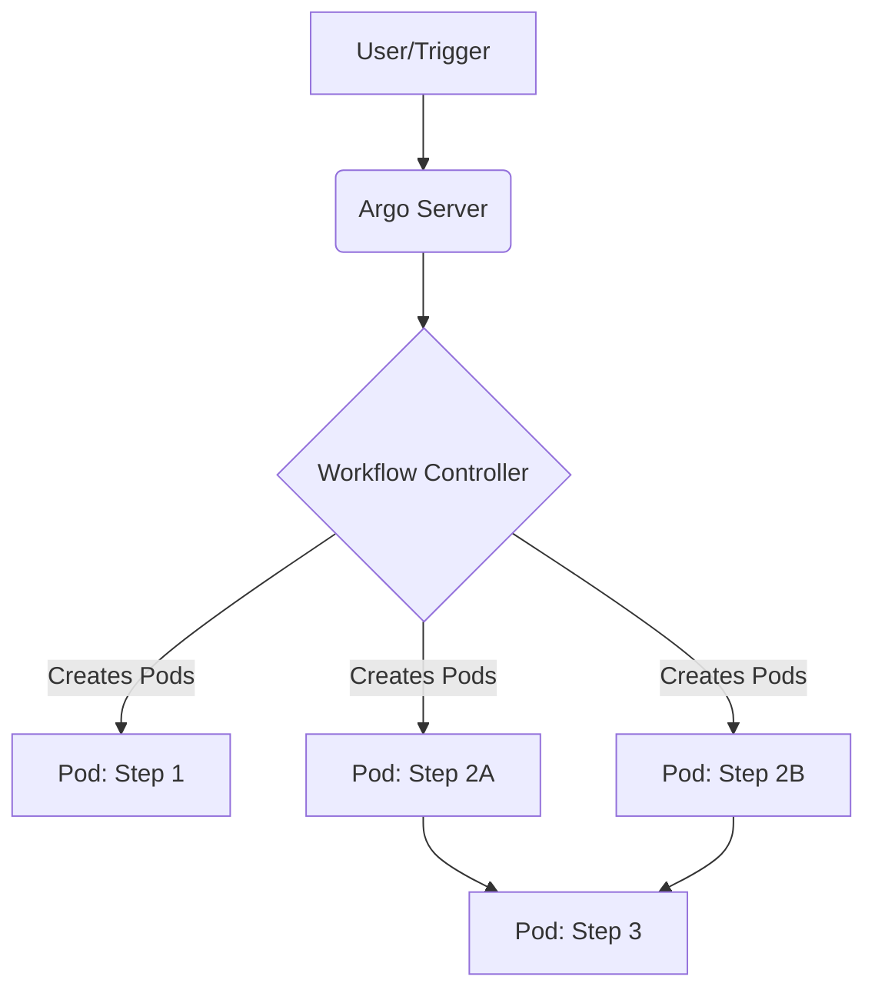

# Argo Workflows

## История боли (DevOps Story)
В эпоху микросервисов и контейнеров CI/CD-пайплайны на базе традиционных инструментов часто сталкивались с ограничениями при выполнении массивных, параллельных вычислений или сложных графов зависимостей (DAG). Боль заключалась в необходимости поддерживать "толстых" воркеров, управлять зоопарком плагинов и бороться с нехваткой ресурсов.
**Решение:** Argo Workflows — это Kubernetes-native движок для оркестрации рабочих процессов, где каждый шаг выполняется в отдельном контейнере. Это позволило использовать всю мощь K8s для масштабирования, строгой изоляции окружений и управления ресурсами каждого отдельного шага пайплайна.

## Архитектура



## Примеры

### CLI (bash)
```bash
# Запуск workflow из файла и наблюдение за прогрессом
argo submit --watch my-workflow.yaml

# Просмотр статуса последнего запущенного workflow
argo get @latest

# Список всех запущенных workflow
argo list
```

### YAML (Hello World DAG)
```yaml
apiVersion: argoproj.io/v1alpha1
kind: Workflow
metadata:
  generateName: hello-world-
spec:
  entrypoint: main
  templates:
  - name: main
    dag:
      tasks:
      - name: echo
        template: echo-tmpl
  - name: echo-tmpl
    container:
      image: alpine:latest
      command: [sh, -c]
      args: ["echo Hello Argo Workflows!"]
```

## Day 2 Operations
- **Масштабирование:** Настройка ResourceQuotas в неймспейсах для предотвращения исчерпания ресурсов кластера зависшими или слишком большими workflow.
- **Очистка (Garbage Collection):** Настройка автоматического удаления старых workflow (через `ttlStrategy`), чтобы не переполнять базу etcd кубернетеса.
- **Мониторинг:** Интеграция с Prometheus (сбор метрик от Argo controller) и централизованный сбор логов из подов (например, ELK/Loki).

## Антипаттерны
- **Огромные монолитные Workflow:** Попытка описать гигантский процесс в одном YAML-файле без переиспользования шаблонов (WorkflowTemplates).
- **Игнорирование requests/limits:** Запуск шагов без указания ограничений по ресурсам (CPU/Memory), что приводит к нестабильности кластера и OOMKills.
- **Хранение стейта локально:** Ожидание, что данные между шагами сохранятся на локальном диске пода без использования артефактов (S3) или Persistent Volumes (PVC).
