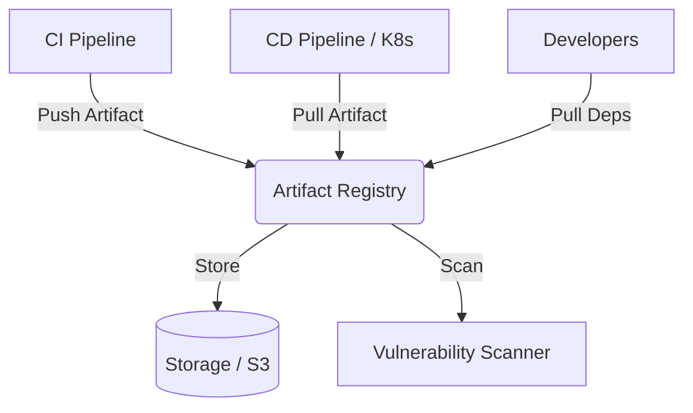

# Artifact Management

## DevOps Story: From Shared Folders to Immutable Registries
**Pain:** Teams were sharing compiled binaries over Slack, FTP, or NFS shares. Deployments failed because nobody knew which version of a library was currently in production, and rolling back was a nightmare.
**Solution:** An Artifact Management system (like Nexus, Artifactory, or Harbor) acts as a single source of truth for immutable binary components, docker images, and packages, ensuring traceability from code to production.

## Architecture


## Example: Pushing and Pulling (bash/YAML)

**Pushing a Docker image to a registry:**
```bash
# Tag the artifact with a semantic version and commit SHA
docker tag myapp:latest registry.internal.corp/team/myapp:v1.2.0-${COMMIT_SHA}

# Authenticate and push
echo $REGISTRY_TOKEN | docker login registry.internal.corp -u ci-bot --password-stdin
docker push registry.internal.corp/team/myapp:v1.2.0-${COMMIT_SHA}
```

**GitLab CI YAML:**
```yaml
publish-artifact:
  stage: publish
  script:
    - npm ci
    - npm run build
    - npm publish --registry https://registry.npmjs.org/
  rules:
    - if: $CI_COMMIT_TAG
```

## Day 2 Operations
- **Retention Policies:** Artifact registries grow exponentially. Implement aggressive cleanup policies for untagged or old snapshot builds, keeping only release versions indefinitely.
- **Proxy Caching:** Set up pull-through caches for external registries (DockerHub, NPM, Maven Central) to avoid rate limits and survive external outages.
- **RBAC & Signing:** Implement strict Role-Based Access Control and enforce image signing (e.g., Cosign) to ensure only signed artifacts can be deployed.

## Anti-Patterns
- **Overwriting Tags:** Re-pushing an artifact with the same tag (like `v1.0.0` or `latest`). Artifacts must be immutable.
- **Missing Metadata:** Failing to attach metadata (commit SHA, build ID, SBOM) to the artifact, breaking the traceability chain.
- **Storing Code/Secrets:** Using the artifact registry as a Git repository or storing configuration files containing secrets alongside binaries.
