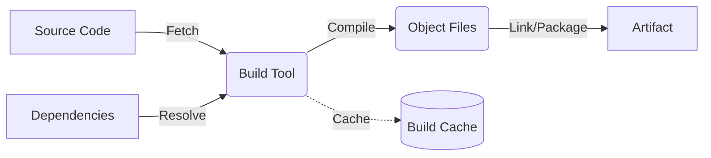

# Build Systems

## DevOps Story: From "Works On My Machine" to Deterministic Builds
**Pain:** Developers complain "It works on my machine!", but builds fail in CI due to missing dependencies, different compiler versions, or environment differences.
**Solution:** A Build System provides a reproducible, automated, and deterministic way to compile code, package assets, and run tests, abstracting away the underlying host environment.

## Architecture


## Example: Make & Docker multi-stage build (YAML/bash)

**Makefile (Local dev & CI entrypoint):**
```bash
.PHONY: build test

build:
	docker build -t myapp:$(COMMIT_SHA) --target builder .

test: build
	docker run --rm myapp:$(COMMIT_SHA) go test ./...
```

**GitHub Actions YAML:**
```yaml
name: Build
on: [push]
jobs:
  build:
    runs-on: ubuntu-latest
    steps:
      - uses: actions/checkout@v4
      - name: Build
        run: make build COMMIT_SHA=${{ github.sha }}
```

## Day 2 Operations
- **Cache Invalidation:** Monitor cache hit rates. Stale caches can cause weird bugs, while constantly busting cache slows down builds.
- **Dependency Scanning:** Integrate tools (like Dependabot or Trivy) to scan for vulnerabilities during the build phase.
- **Build Matrix Optimization:** Identify slow paths and parallelize tests or multi-platform builds.

## Anti-Patterns
- **Snowflake Build Servers:** Relying on global state installed on the Jenkins/GitLab runner instead of containerizing the build environment.
- **Non-Deterministic Builds:** Downloading latest dependencies (`latest` tag) instead of pinning exact versions (using lock files like `go.sum`, `package-lock.json`).
- **Secret Leaks:** Baking credentials or API keys into the built artifact or Docker image layers.
