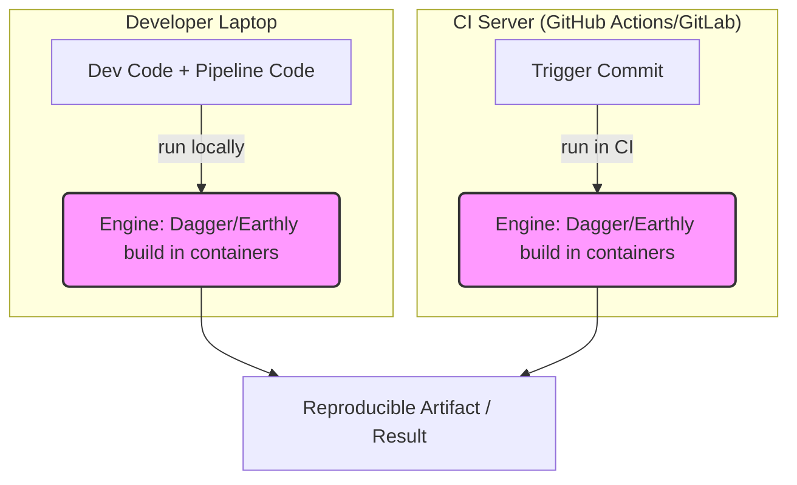

# CI as Code (Dagger, Earthly)

## 📖 История: Боль и Решение

**Боль:** "На моем компьютере это работает, а в CI падает!". Разработчики пишут CI пайплайны на YAML (GitHub Actions, GitLab CI), который невозможно протестировать локально. Приходится делать десятки "wip" коммитов в надежде, что пайплайн пройдет. YAML-файлы разрастаются до тысяч строк, превращаясь в нечитаемую "YAML-лапшу" без нормального переиспользования и типизации.

**Решение:** CI as Code (Конвейер как код). Использование полноценных языков программирования (Dagger) или знакомого синтаксиса Dockerfile (Earthly) для описания процессов сборки. Пайплайн запускается в контейнерах, что гарантирует идентичность выполнения на ноутбуке разработчика и на сервере CI.

## 🏗 Архитектура (Mermaid)



## 💻 Примеры

### Earthly (Синтаксис похож на Dockerfile + Make)

Файл `Earthfile`:

```earthly
VERSION 0.8
FROM golang:1.21-alpine
WORKDIR /app

build:
    COPY main.go .
    RUN go build -o bin/myapp main.go
    SAVE ARTIFACT bin/myapp AS LOCAL build/myapp

docker:
    FROM alpine:3.18
    COPY +build/myapp /usr/local/bin/myapp
    ENTRYPOINT ["myapp"]
    SAVE IMAGE myapp:latest
```

Запуск локально и в CI: `earthly +docker`

### Dagger (Go / Python / TypeScript)

Пример на Go (`main.go`):

```go
package main

import (
    "context"
    "fmt"
    "os"
    "dagger.io/dagger"
)

func main() {
    ctx := context.Background()
    client, _ := dagger.Connect(ctx, dagger.WithLogOutput(os.Stdout))
    defer client.Close()

    src := client.Host().Directory(".")
    
    builder := client.Container().
        From("golang:1.21").
        WithDirectory("/src", src).
        WithWorkdir("/src").
        WithExec([]string{"go", "build", "-o", "myapp"})

    _, _ = builder.Sync(ctx)
    fmt.Println("Build successful!")
}
```

Запуск локально и в CI: `go run main.go`

## 🛠 Day 2 Operations

*   **Интеграция с существующим CI:** Dagger и Earthly не заменяют Jenkins или GitLab CI, они инкапсулируют логику *сборки*. В YAML файле CI у вас останется только один шаг: запуск скрипта Dagger или Earthly.
*   **Кэширование слоев:** Оба инструмента активно используют кэширование слоев контейнеров (подобно Docker). Для ускорения работы в CI необходимо настроить удаленный кэш (например, в registry), чтобы раннеры могли шарить слои между собой.
*   **Безопасность (Secrets):** Не хардкодьте секреты. Используйте встроенные механизмы инструментов для проброса секретов (`--secret` в Earthly или `WithSecretVariable` в Dagger), чтобы они не попали в кэш или историю образов.

## ☠️ Антипаттерны

*   **Попытка переписать ВСЕ сразу:** Не стоит одномоментно переносить огромный legacy пайплайн с YAML на Dagger. Начинайте с самых нестабильных или сложных шагов сборки.
*   **Запуск Dagger/Earthly вне контейнеризованных CI-раннеров:** Если ваш CI-раннер не поддерживает запуск Docker (Docker-in-Docker), использование этих инструментов потребует настройки дополнительных remote-серверов сборки, что усложнит инфраструктуру.
*   **Сложная бизнес-логика в Earthfile:** Earthly отлично подходит для сборки, но для сложной условной логики (if/else, циклы) лучше подходит Dagger (так как это полноценный язык программирования). Не пытайтесь сделать из Earthfile скрипт на Bash.
