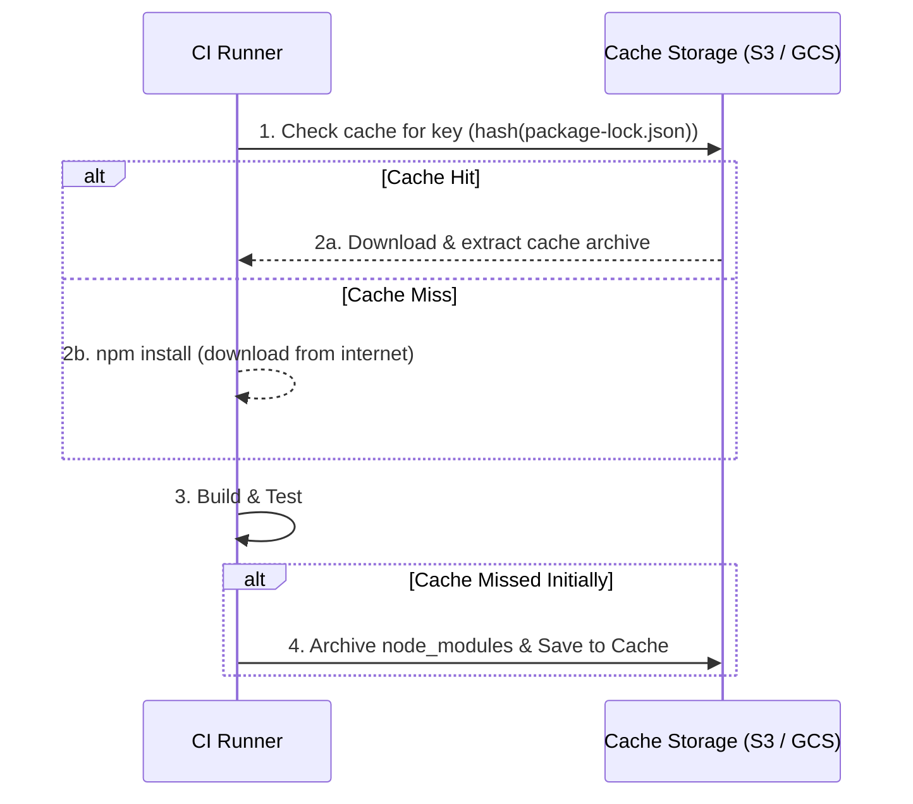

# Cache в CI

## 📖 История: Боль и Решение

**Боль:** Сборка проекта занимает 15 минут, из которых 10 минут уходит на скачивание одних и тех же зависимостей (npm packages, Maven artifacts, Go modules) при каждом коммите. Разработчики ждут, контекст теряется.

**Решение:** Кэширование в CI. Мы сохраняем скачанные зависимости после успешной сборки и восстанавливаем их в начале следующей. Ключом кэша обычно выступает хэш файла фиксации зависимостей (например, `package-lock.json`, `go.sum`).

## 🏗 Архитектура (Mermaid)



## 💻 Примеры

### GitHub Actions (YAML)

Пример кэширования для Node.js проекта:

```yaml
steps:
  - uses: actions/checkout@v4

  - name: Setup Node.js
    uses: actions/setup-node@v4
    with:
      node-version: '20'

  - name: Cache node modules
    uses: actions/cache@v3
    env:
      cache-name: cache-node-modules
    with:
      path: ~/.npm # Или node_modules (зависит от пакетного менеджера)
      key: ${{ runner.os }}-build-${{ env.cache-name }}-${{ hashFiles('**/package-lock.json') }}
      restore-keys: |
        ${{ runner.os }}-build-${{ env.cache-name }}-
        ${{ runner.os }}-build-
        ${{ runner.os }}-

  - name: Install Dependencies
    run: npm ci

  - name: Build
    run: npm run build
```

## 🛠 Day 2 Operations

*   **Инвалидация кэша:** Что делать, если кэш «отравился» (corrupted)? Нужно иметь возможность вручную удалить кэш или изменить префикс ключа кэша (например, добавить `v2-`), чтобы форсировать создание нового.
*   **Очистка (Garbage Collection):** Кэши занимают место. Настройте политики жизненного цикла (Lifecycle Policies) в вашем хранилище (например, удалять кэши старше 30 дней) или используйте встроенные лимиты платформы CI (в GitHub Actions лимит 10GB на репозиторий).
*   **Мониторинг:** Следите за метриками Cache Hit Rate. Если он постоянно низкий (cache miss), возможно, ваш ключ кэширования слишком часто меняется или кэшируются неправильные директории.

## ☠️ Антипаттерны

*   **Кэширование бинарников или артефактов сборки вместо зависимостей:** Кэш предназначен для сторонних неизменяемых зависимостей, а не для результатов вашей собственной сборки. Для передачи артефактов между этапами (stages) используйте механизм артефактов (artifacts).
*   **Использование слишком широкого ключа кэша:** Если ключ зависит от коммита (`git rev-parse HEAD`), кэш никогда не попадет, так как каждый коммит уникален. Ключ должен зависеть от *lock-файла* зависимостей.
*   **Кэширование директорий с абсолютными путями:** Пути на разных раннерах могут отличаться. Всегда используйте относительные пути или системные переменные, предоставляемые CI.
*   **Отсутствие `restore-keys`:** Если точного совпадения по ключу (с хэшем `lock`-файла) нет, fallback ключи позволяют восстановить старый кэш, и пакетному менеджеру придется скачать только *новые* зависимости, а не всё с нуля.
