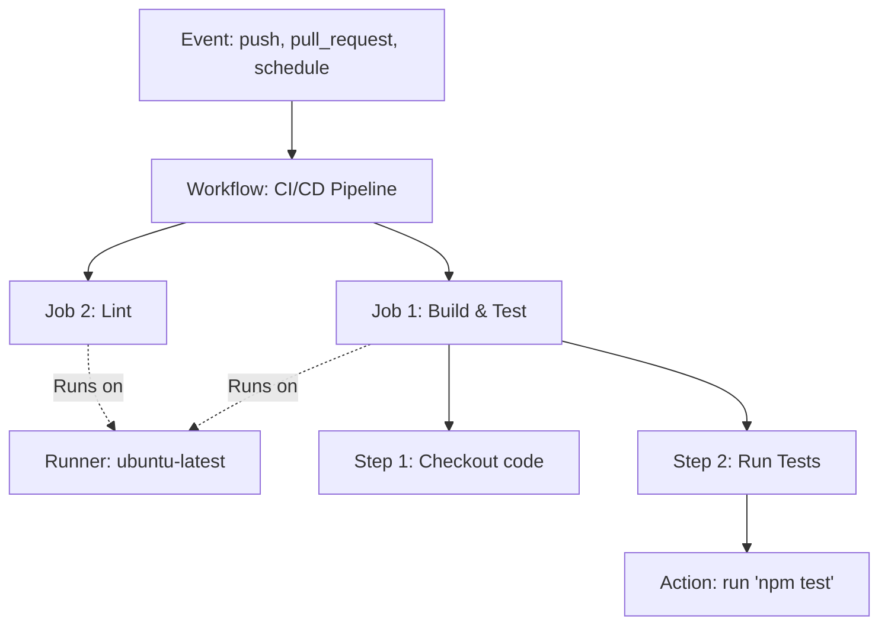

# Основы Workflows в GitHub Actions

## DevOps-история: От ручной боли к автоматизации

**Боль:** В команде из 5 разработчиков каждый деплоил код со своей локальной машины. Это приводило к классическому "у меня работает", забытым миграциям БД и случайным простоям, потому что кто-то забыл прогнать тесты перед релизом. Релизы занимали часы и требовали присутствия Senior'а.

**Решение:** Внедрение GitHub Actions. Мы описали процесс сборки и тестирования в коде (Pipeline as Code). Теперь любой пуш в `main` автоматически триггерит изолированную среду, которая собирает проект, прогоняет тесты и деплоит на staging. Релиз стал кнопкой, а не ритуалом.

## Архитектура Workflow



## Примеры кода

### Базовый YAML Workflow (`.github/workflows/ci.yml`)
```yaml
name: Node.js CI

on:
  push:
    branches: [ "main" ]
  pull_request:
    branches: [ "main" ]

jobs:
  build:
    runs-on: ubuntu-latest

    steps:
    - name: Checkout repository
      uses: actions/checkout@v4

    - name: Setup Node.js
      uses: actions/setup-node@v4
      with:
        node-version: '20.x'
        cache: 'npm'

    - name: Install dependencies
      run: npm ci

    - name: Run linter and tests
      run: |
        npm run lint
        npm test
```

## Day 2 Operations (Эксплуатация)

- **Мониторинг биллингов:** GitHub Actions тарифицируется по минутам. Настройте алерты на расход лимитов в организации.
- **Оптимизация скорости:** Внедряйте кэширование зависимостей (`actions/cache`) и используйте легковесные образы.
- **Безопасность:** Регулярная ротация секретов и использование OIDC (OpenID Connect) для интеграции с облаками (AWS/GCP) вместо статических токенов.
- **Self-hosted runners:** При превышении лимитов или строгих security политиках переходите на свои раннеры (на K8s через ARC - Actions Runner Controller).

## Антипаттерны

1. **`ubuntu-latest` везде без оглядки:** В production-критичных пайплайнах лучше фиксировать мажорную версию (например, `ubuntu-22.04`), чтобы избежать внезапных поломок при обновлении `latest`.
2. **Толстые шаги (God Steps):** Выполнение огромных bash-скриптов в одном шаге `run`. Сложно дебажить. Разбивайте логику на логические шаги.
3. **Хардкод секретов:** Хранение токенов прямо в коде или в открытом виде в логах. Всегда используйте `${{ secrets.MY_SECRET }}`.
4. **Отсутствие Concurrency:** Запуск параллельных пайплайнов деплоя, которые перезаписывают состояние друг друга. Используйте блок `concurrency` для отмены устаревших сборок на PR.
