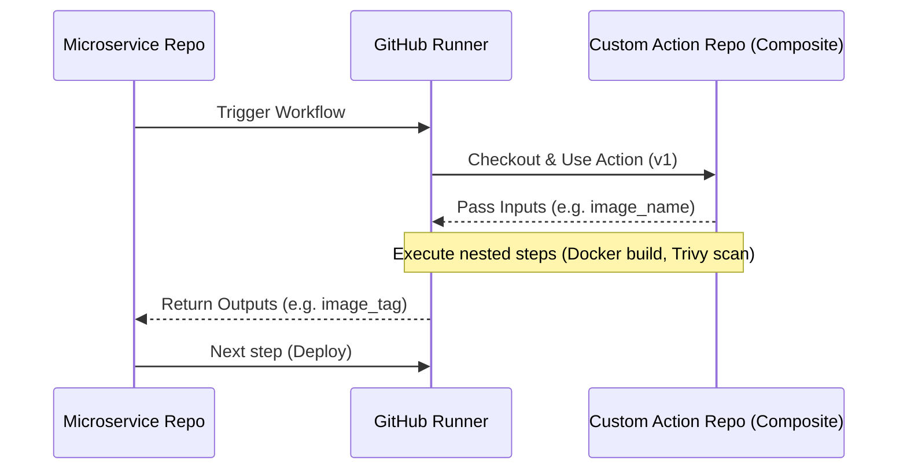

# Custom Actions

## DevOps-история: Борьба с копипастой

**Боль:** По мере роста компании у нас появилось 20+ микросервисов. В каждом репозитории лежал огромный `.github/workflows/deploy.yml` на 200 строк. Когда безопасники потребовали добавить обязательный шаг проверки на уязвимости (Trivy), нам пришлось вручную делать 20 PR. DRY (Don't Repeat Yourself) плакал в углу.

**Решение:** Мы создали свои Custom Actions. Вынесли общую логику сборки Docker-образа и сканирования в отдельный централизованный репозиторий. Теперь в микросервисах workflow состоит из 20 строк, вызывающих наше кастомное действие. Обновление логики CI происходит в одном месте для всех команд.

## Как работают Composite Actions



## Примеры кода

### 1. Создание Composite Action (`action.yml` в репо `my-org/docker-build-action`)
```yaml
name: 'Build and Scan Docker Image'
description: 'Builds a Docker image and scans it with Trivy'
inputs:
  image_name:
    description: 'Name of the docker image'
    required: true
outputs:
  image_tag:
    description: 'The tag of the built image'
    value: ${{ steps.set-tag.outputs.tag }}
runs:
  using: "composite"
  steps:
    - name: Generate Tag
      id: set-tag
      shell: bash
      run: echo "tag=$(git rev-parse --short HEAD)" >> $GITHUB_OUTPUT

    - name: Build image
      shell: bash
      run: docker build -t ${{ inputs.image_name }}:${{ steps.set-tag.outputs.tag }} .

    - name: Run Trivy vulnerability scanner
      uses: aquasecurity/trivy-action@master
      with:
        image-ref: '${{ inputs.image_name }}:${{ steps.set-tag.outputs.tag }}'
        format: 'table'
        exit-code: '1'
        severity: 'CRITICAL,HIGH'
```

### 2. Использование Action в микросервисе
```yaml
jobs:
  build:
    runs-on: ubuntu-latest
    steps:
      - uses: actions/checkout@v4
      
      - name: Use Custom Build Action
        uses: my-org/docker-build-action@v1 # Ссылка на наш action
        with:
          image_name: 'my-microservice'
```

## Day 2 Operations (Эксплуатация)

- **Версионирование:** Обязательно используйте семантическое версионирование (теги `v1.0.0`) и поддерживайте мажорные ветки (`v1`), чтобы не сломать пайплайны зависимым командам при обратно несовместимых изменениях.
- **Изоляция:** Для сложной логики (где Bash не справляется) пишите JavaScript Actions или Docker Container Actions.
- **Тестирование:** Тестируйте сами Custom Actions с помощью инструментов вроде `act` или создайте тестовые workflows в репозитории экшена.
- **Документация:** Файл `README.md` в корне экшена с таблицей inputs/outputs обязателен для переиспользования.

## Антипаттерны

1. **Монолитные Actions:** Создание "Божественного Экшена", который делает всё: линтит, собирает, деплоит в AWS и шлёт в Slack. Разделяйте экшены по Single Responsibility Principle.
2. **Отсутствие валидации Inputs:** Не доверяйте входящим параметрам. Если параметр ожидается как число, проверяйте это, иначе bash скрипт внутри composite action может повести себя непредсказуемо.
3. **Хардкод путей:** Использование абсолютных путей внутри экшена (например `/home/runner/work/...`). Используйте системные переменные GitHub (`${{ github.workspace }}`).
4. **Слепое использование `@master`:** Призыв чужих (или своих) экшенов по ветке `master` или `main`. Любой коммит туда может сломать ваш CI. Всегда используйте конкретные теги (например, `@v2.1.0`).
