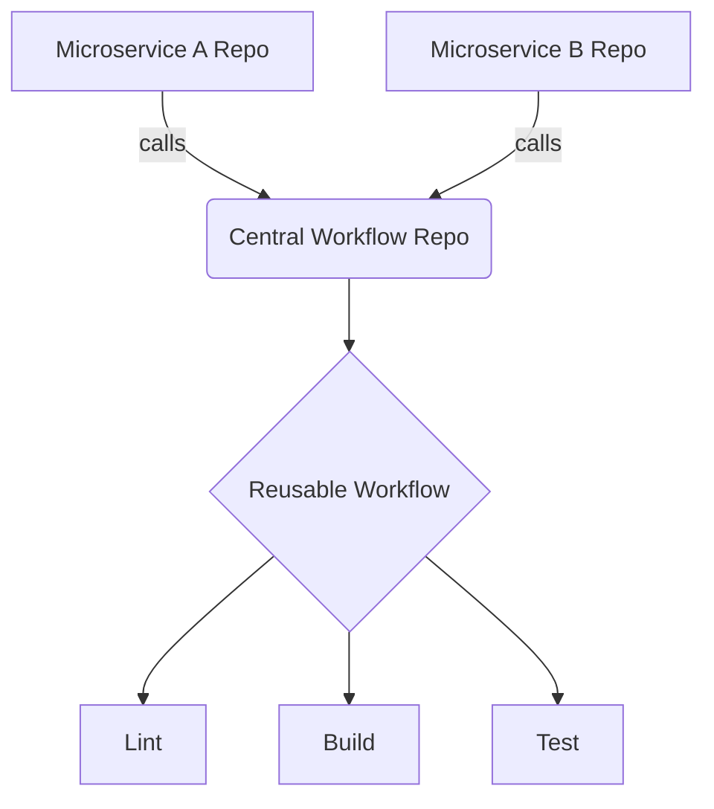

# Reusable Workflows in GitHub Actions

## 📖 История: От боли к решению
**Боль:** У вас 50 микросервисов, и каждый раз при изменении версии линтера или шага деплоя приходится править 50 файлов `.github/workflows/ci.yml`. Copy-paste порождает ошибки и рассинхронизацию пайплайнов.
**Решение:** Reusable Workflows позволяют вынести общую логику пайплайна в один центральный репозиторий. Все микросервисы просто ссылаются на него, передавая нужные параметры.

## 🏗 Архитектура (Mermaid)


## 💻 Примеры кода

**1. Центральный workflow (called workflow):** `.github/workflows/reusable-build.yml`
```yaml
name: Reusable Build
on:
  workflow_call:
    inputs:
      node_version:
        required: true
        type: string
    secrets:
      NPM_TOKEN:
        required: true

jobs:
  build:
    runs-on: ubuntu-latest
    steps:
      - uses: actions/checkout@v4
      - uses: actions/setup-node@v4
        with:
          node-version: ${{ inputs.node_version }}
      - run: npm install
        env:
          NODE_AUTH_TOKEN: ${{ secrets.NPM_TOKEN }}
      - run: npm run build
```

**2. Вызов из микросервиса (caller workflow):** `.github/workflows/ci.yml`
```yaml
name: CI
on: [push]

jobs:
  call-build:
    uses: my-org/central-workflows/.github/workflows/reusable-build.yml@main
    with:
      node_version: '20'
    secrets:
      NPM_TOKEN: ${{ secrets.NPM_TOKEN }}
```

## 🛠 Day 2 Operations
- **Версионирование:** Всегда вызывайте workflow по конкретному тегу или SHA (например, `@v1.2.0`), а не по `@main`. Это защитит микросервисы от поломок при мажорных изменениях в центральном репозитории.
- **Матричные сборки:** Вызывающий workflow может использовать `strategy.matrix` для запуска reusable workflow с разными параметрами.

## 🚫 Антипаттерны
- **Монструозный workflow:** Попытка впихнуть все возможные сценарии (и фронт, и бэк, и мобилки) в один гигантский reusable workflow с сотней `if` условий. Разделяйте их по логическим доменам.
- **Жесткое кодирование секретов:** Использование секретов напрямую внутри reusable workflow без передачи их через `secrets:` блока `workflow_call` делает workflow менее переиспользуемым.
