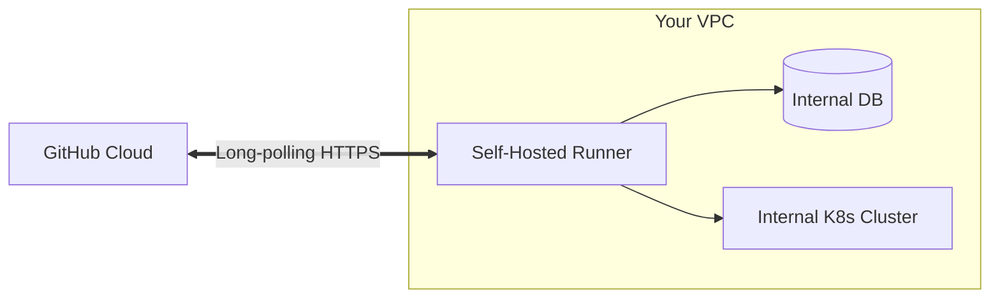

# Self-Hosted Runners in GitHub Actions

## 📖 История: От боли к решению
**Боль:** Публичные раннеры GitHub слишком медленные для больших монолитов, обходятся дорого при интенсивном использовании, а главное — не имеют доступа к вашим внутренним базам данных и сервисам в закрытом VPC для проведения интеграционных тестов.
**Решение:** Self-Hosted Runners. Вы разворачиваете агенты GitHub на своих серверах (EC2, Kubernetes, On-Prem). Они работают внутри вашего контура, быстрее кэшируют зависимости, имеют нужные доступы и экономят минуты GitHub.

## 🏗 Архитектура (Mermaid)


## 💻 Примеры кода

**1. Добавление и настройка раннера (Bash):**
```bash
# Скачивание раннера на Linux
mkdir actions-runner && cd actions-runner
curl -o actions-runner-linux-x64-2.311.0.tar.gz -L https://github.com/actions/runner/releases/download/v2.311.0/actions-runner-linux-x64-2.311.0.tar.gz
tar xzf ./actions-runner-linux-x64-2.311.0.tar.gz

# Конфигурация (токен берется в UI репозитория/организации)
./config.sh --url https://github.com/my-org/my-repo --token ABCDEFGHIJKLMNOPQRSTUVWXYZ

# Запуск в качестве systemd сервиса
sudo ./svc.sh install
sudo ./svc.sh start
```

**2. Использование в workflow (YAML):**
```yaml
name: Internal CI
on: [push]

jobs:
  build:
    # Указываем лейблы нашего self-hosted раннера
    runs-on: [self-hosted, linux, x64, internal-net]
    steps:
      - uses: actions/checkout@v4
      - run: echo "Running securely inside our VPC!"
```

## 🛠 Day 2 Operations
- **Автомасштабирование:** Используйте решения вроде ARC (Actions Runner Controller) для динамического создания pod-ов раннеров в Kubernetes в зависимости от длины очереди webhook-ов.
- **Очистка стейта:** В отличие от GitHub-hosted, self-hosted раннеры по умолчанию сохраняют состояние файловой системы между джобами. Настройте очистку воркспейса в конце шагов или используйте эфемерные раннеры (`--ephemeral`).

## 🚫 Антипаттерны
- **Self-hosted для публичных репозиториев:** Опаснейшая уязвимость. Злоумышленник может открыть Pull Request с вредоносным кодом, который исполнится прямо в вашей внутренней сети.
- **Запуск от рута:** Запуск процесса раннера с правами `root`. Всегда используйте отдельного непривилегированного пользователя для минимизации blast radius при компрометации раннера.
