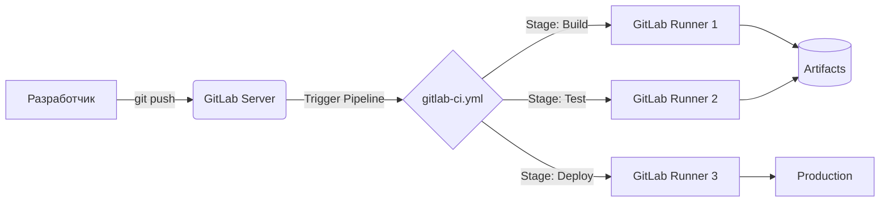

# Основы .gitlab-ci.yml

## DevOps-история: Решение боли
**Боль:** Команда релизит приложение руками. Вася запускает тесты локально (и иногда забывает), Петя копирует артефакты через `scp`, а Маша правит конфиги на бою. Результат: простои, баги в проде, отсутствие истории изменений и "работает на моей машине".

**Решение:** Внедрение CI/CD через файл `.gitlab-ci.yml`. Теперь весь процесс сборки, тестирования и деплоя описан кодом (Pipeline as Code). Процесс автоматизирован, повторяем и прозрачен для всей команды. GitLab Runner берёт на себя грязную работу.

## Mermaid-схема: Архитектура GitLab CI



## Пример YAML

Минимальный жизнеспособный `.gitlab-ci.yml`:

```yaml
default:
  image: node:18-alpine

variables:
  APP_ENV: "production"

stages:
  - build
  - test
  - deploy

build_app:
  stage: build
  script:
    - echo "Сборка приложения..."
    - npm ci
    - npm run build
  artifacts:
    paths:
      - dist/
    expire_in: 1 week

test_app:
  stage: test
  script:
    - echo "Запуск тестов..."
    - npm run test

deploy_app:
  stage: deploy
  script:
    - echo "Деплой приложения на сервер..."
    - ./deploy.sh $APP_ENV
  only:
    - main
```

## Пример Bash-скрипта (deploy.sh)

```bash
#!/bin/bash
ENV=$1
echo "Deploying to $ENV environment..."
# Пример копирования артефактов (в реальности лучше использовать ansible или docker)
scp -r dist/ user@server:/var/www/app-$ENV/
systemctl restart myapp
echo "Deploy successful!"
```

## Day 2 Operations
- **Управление Runners:** Масштабирование GitLab Runners (использование автоскейлинга, например, с Kubernetes или AWS ASG).
- **Очистка (Garbage Collection):** Настройка сроков хранения артефактов (`expire_in`), чтобы не переполнить диски сервера GitLab.
- **Оптимизация кэша:** Настройка глобального кэша для зависимостей (например, `node_modules` или `.m2`), чтобы ускорить время выполнения пайплайна.
- **Безопасность:** Использование Secret Variables вместо хардкода паролей в файле. Интеграция с Vault.

## Антипаттерны
- **Хардкод секретов:** Хранение токенов, паролей и ключей прямо в `.gitlab-ci.yml`.
- **Один огромный Job (Monolithic Job):** Сваливание команд сборки, тестов и деплоя в один скрипт. В случае падения непонятно, на каком этапе произошла ошибка.
- **Игнорирование версий образов:** Использование `image: node:latest` или `ubuntu:latest`. Обновление образа сломает пайплайн в неожиданный момент.
- **Отсутствие тэгов (tags) у runner'ов:** Запуск тяжелых сборок на слабых общих runner'ах, когда для этого есть выделенные.
