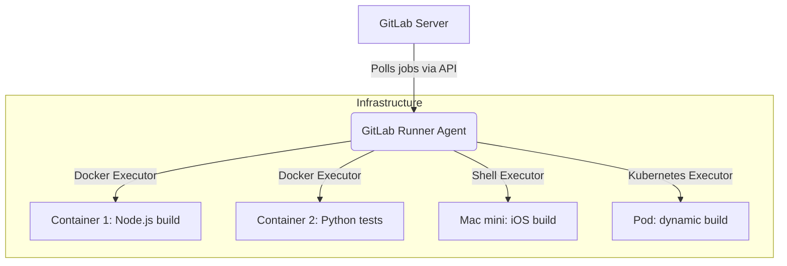

# GitLab Runners

## 📖 История: Как мы перестали ждать пайплайны
**Боль:** Вся команда использовала общие (Shared) раннеры, предоставляемые GitLab. Когда начинался релизный цикл, пайплайны выстраивались в огромную очередь и ждали по 40 минут. К тому же, для сборки мобильного приложения требовался macOS, которого в стандартном пуле не было, а тесты требовали мощной БД.
**Решение:** Мы развернули собственные (Specific/Group) GitLab Runners. Подняли пул легких Docker-раннеров в Kubernetes для стандартных сборок (с автоскейлингом), и отдельный Shell-раннер на Mac mini для iOS. Очереди исчезли, сборки ускорились в 3 раза за счет кэширования на своих серверах.

## 🏗 Архитектура и связи (Mermaid)



## 💻 Пример использования (Bash/YAML)

**Регистрация Runner'а (Bash):**
```bash
gitlab-runner register \
  --non-interactive \
  --url "https://gitlab.com/" \
  --registration-token "PROJECT_OR_GROUP_TOKEN" \
  --executor "docker" \
  --docker-image alpine:latest \
  --description "docker-builder" \
  --tag-list "docker, builder" \
  --run-untagged="true" \
  --locked="false"
```

**Использование тегов в `.gitlab-ci.yml`:**
```yaml
build_ios:
  stage: build
  tags:
    - macos # Эта job'а выполнится только на Mac-раннере
  script:
    - xcodebuild -workspace MyApp.xcworkspace -scheme MyApp clean archive

test_backend:
  stage: test
  tags:
    - docker
  image: python:3.9
  script:
    - pip install -r requirements.txt
    - pytest
```

## 🛠 Day 2 Operations (Эксплуатация)
- **Мониторинг:** Настройка сбора метрик Prometheus с Runner'ов (встроенный endpoint `listen_address`) для отслеживания утилизации и очередей.
- **Очистка кэша и образов:** Регулярный запуск `docker system prune` на хостах с Docker executor, иначе диск быстро забьется старыми слоями.
- **Автоскейлинг:** Настройка Kubernetes executor или Docker Machine для динамического создания Runner'ов под нагрузку и экономии ресурсов в нерабочее время.

## ⛔ Антипаттерны
- **Запуск всего на Shell executor'е:** Приводит к конфликту зависимостей между разными проектами и "загрязнению" состояния сервера. Всегда лучше использовать Docker/Kubernetes executors.
- **Использование `privileged: true` без необходимости:** Запуск контейнеров с полными правами на хостовой машине несет огромные риски безопасности (Docker-in-Docker можно настроить безопаснее или использовать Kaniko).
- **Один большой Runner на всю компанию:** Единая точка отказа. Лучше использовать пул менее мощных машин с балансировкой нагрузки.
