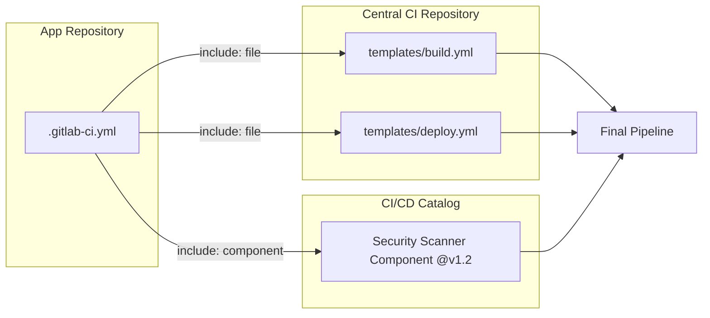

# Includes и Components в GitLab CI

## 📖 История боли и решения
**Боль:** В крупных энтерпрайз-проектах десятки микросервисов используют похожие CI/CD пайплайны. Копипаст `.gitlab-ci.yml` приводит к тому, что обновление уязвимости в пайплайне деплоя требует ручного изменения 50+ репозиториев. "Лапша" из YAML становится неуправляемой.
**Решение:** Внедрение механизмов модульности. Сначала появился `include`, позволяющий подключать внешние YAML-файлы. Затем GitLab шагнул дальше и представил **CI/CD Components** (каталог компонентов), который позволяет версионировать, публиковать и переиспользовать изолированные куски пайплайнов с входными параметрами, превращая CI в настоящий код.

## 🏗 Архитектура (Mermaid)



## 🛠 Примеры (YAML / Bash)

### Базовый Include
```yaml
include:
  # Локальный инклюд
  - local: '/ci/scripts.yml'
  # Инклюд из другого проекта (централизованные шаблоны)
  - project: 'my-group/central-ci'
    ref: main
    file: '/templates/docker-build.yml'
  # Удаленный инклюд
  - remote: 'https://example.com/ci-templates/test.yml'
```

### Использование CI/CD Component
```yaml
include:
  - component: gitlab.com/my-org/components/docker-build/build@1.0.0
    inputs:
      image_name: "my-app"
      stage: "build"

stages:
  - build
  - test
  - deploy
```

## 🚀 Day 2 Operations (Обслуживание и траблшутинг)
1. **Версионирование шаблонов:** Никогда не подключайте `include` или `components` по ветке `main` в продакшен проектах. Всегда используйте теги (релизы) или стабильные коммиты (`ref: v1.2.3`). Это предотвратит внезапные падения пайплайнов при обновлении центрального шаблона.
2. **Отладка собранного пайплайна:** Используйте вкладку "Merged YAML" в GitLab CI Lint. Она показывает итоговый скомпилированный файл после всех `include`, что бесценно при поиске коллизий в переменных или джобах.
3. **Миграция на Components:** Планируйте постепенный переезд с обычных `include: project` на `components`, так как компоненты предоставляют строгую валидацию инпутов и публикуются в удобном каталоге.

## 🛑 Антипаттерны
- **Глубокая вложенность:** Инклюды, которые инклюдят другие инклюды на 3-4 уровня в глубину. Это делает траблшутинг невозможным.
- **Переопределение скрытых джобов:** Использование общих имен джобов в проекте, которые случайно переопределяют джобы из подключенных шаблонов.
- **Хардкод секретов в центральных шаблонах:** Центральные шаблоны должны быть универсальными. Секреты следует передавать через CI/CD Variables на уровне конкретного проекта или группы.
