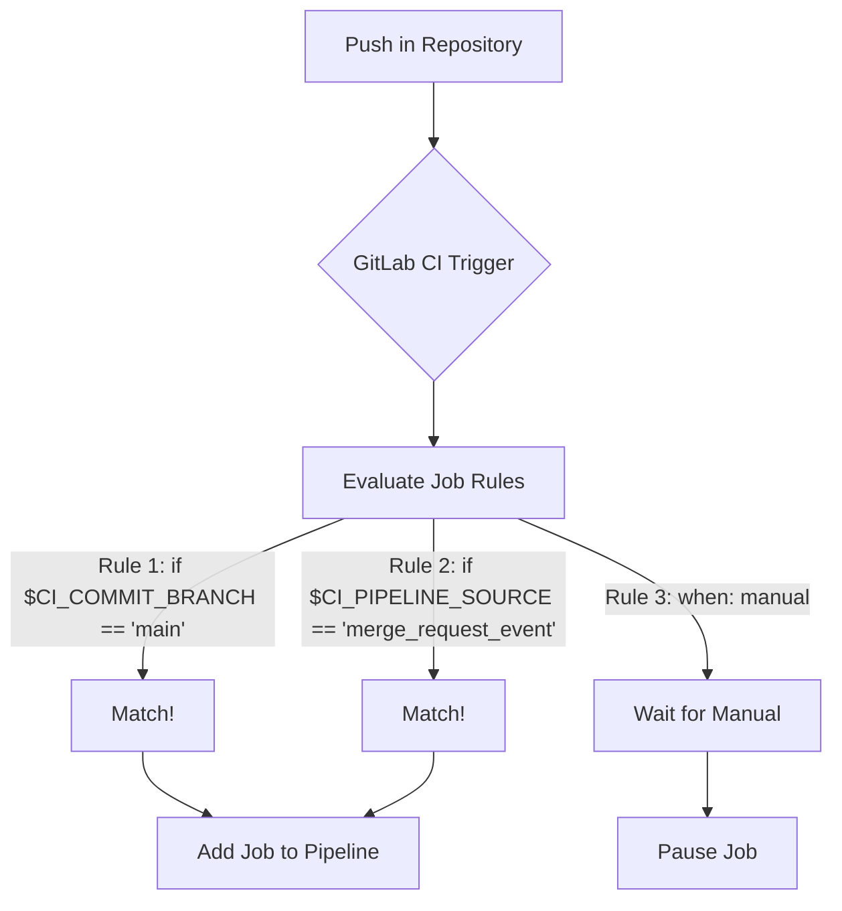

# Rules (вместо Only/Except) в GitLab CI

## 📖 История боли и решения
**Боль:** В первых версиях пайплайнов инженеры использовали директивы `only` и `except` для контроля запуска джобов. По мере роста проекта пайплайны превращались в кашу: логика ветвления усложнялась, а `only/except` не позволяли гибко комбинировать условия (например, запуск только при изменении конкретных файлов AND наличии определенной переменной).
**Решение:** GitLab внедрил блок `rules`, который предоставляет мощный, читаемый и гибкий механизм условий. Он заменил устаревшие `only/except`, позволив выстраивать сложную логику, управлять переменными на лету и использовать регулярные выражения.

## 🏗 Архитектура и схема работы (Mermaid)



## 🛠 Примеры (YAML)

### Антипаттерн (Устаревший подход)
```yaml
deploy_prod:
  script: echo "Deploying..."
  only:
    - main
  except:
    - tags
```

### Best Practice (Использование Rules)
```yaml
deploy_prod:
  script: echo "Deploying to production..."
  rules:
    # Запуск только для main ветки, если это не расписание
    - if: '$CI_COMMIT_BRANCH == "main" && $CI_PIPELINE_SOURCE != "schedule"'
      when: on_success
    # Ручной запуск для тегов
    - if: '$CI_COMMIT_TAG'
      when: manual
    # Не запускать во всех остальных случаях (поведение по умолчанию, но можно указать явно)
    - when: never
```

### Динамическое изменение переменных через Rules
```yaml
build:
  script: docker build -t $IMAGE_NAME .
  rules:
    - if: '$CI_COMMIT_BRANCH == "main"'
      variables:
        IMAGE_NAME: "myapp:prod"
    - if: '$CI_COMMIT_BRANCH != "main"'
      variables:
        IMAGE_NAME: "myapp:dev-$CI_COMMIT_SHORT_SHA"
```

## 🚀 Day 2 Operations (Обслуживание и траблшутинг)
1. **Отладка Rules:** Используйте CI Lint в интерфейсе GitLab для проверки логики `rules`. Синтаксические ошибки часто возникают из-за неправильного экранирования регулярных выражений (например, `if: '$CI_COMMIT_MESSAGE =~ /skip-ci/'`).
2. **Шаблонизация:** Выносите сложные `rules` в общие `workflow:rules` или переиспользуемые блоки (`!reference`), чтобы не дублировать логику в каждой джобе.
3. **Логирование:** В случае сложной логики передавайте переменные, сформированные в `rules`, в скрипт и выводите их через `echo` для понимания, какое правило сработало.

## 🛑 Антипаттерны
- **Смешивание only/except и rules:** Нельзя использовать обе директивы в одной джобе, это вызовет ошибку валидации CI.
- **Отсутствие `when: never`:** Оставление неявного поведения при сложных ветвлениях. Лучше явно прописывать дефолтный сценарий в конце списка `rules`.
- **Избыточные регулярные выражения:** Использование `=~` там, где достаточно точного сравнения `==`, что усложняет чтение и поддержку.
