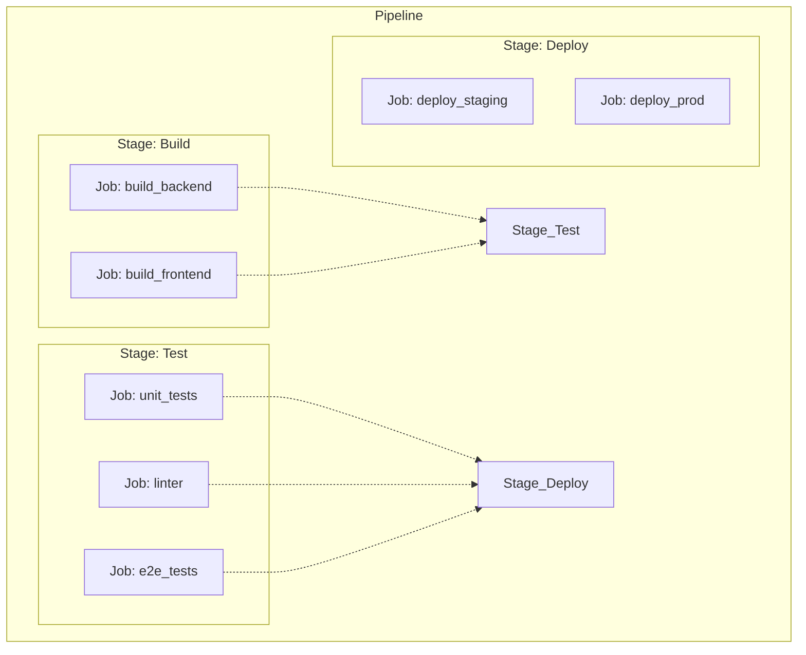

# Stages и Jobs в GitLab CI

## DevOps-история: Решение боли
**Боль:** Изначально разработчики автоматизировали всё с помощью одного длинного bash-скрипта в одном Job. Скрипт падал где-то посередине, и приходилось запускать весь процесс заново: пересобирать докер-образ, заново скачивать зависимости, чтобы понять, что упали только линтеры.

**Решение:** Разделение пайплайна на **Stages** (этапы) и **Jobs** (задачи). Stages выполняются последовательно (Build -> Test -> Deploy), а Jobs внутри одного Stage могут выполняться параллельно. Теперь, если упали линтеры, сборка образа даже не начнется, а перезапустить можно только упавший Job, сэкономив массу времени.

## Mermaid-схема: Иерархия Stages и Jobs



## Пример YAML (Stages & Jobs)

```yaml
stages:
  - build
  - test
  - deploy

# Stage: Build
build_backend:
  stage: build
  script:
    - make build-backend

build_frontend:
  stage: build
  script:
    - npm run build

# Stage: Test (запускаются параллельно после успешного Build)
unit_tests:
  stage: test
  script:
    - make test

linter:
  stage: test
  script:
    - eslint .

# Stage: Deploy
deploy_staging:
  stage: deploy
  environment: staging
  script:
    - ./deploy.sh staging

deploy_prod:
  stage: deploy
  environment: production
  script:
    - ./deploy.sh production
  when: manual # Ручной запуск для продакшена
```

## Пример Bash-скрипта для Job

```bash
#!/bin/bash
# Скрипт проверки линтеров (можно вызывать прямо в секции script)
echo "Starting linter check..."
if ! eslint src/ --ext .js,.jsx; then
  echo "Linter failed! Please fix formatting issues."
  exit 1
fi
echo "Linter passed!"
```

## Day 2 Operations
- **Управление зависимостями Jobs:** Использование ключевого слова `needs` для создания направленных ациклических графов (DAG). Это позволяет Job'у из этапа `test` стартовать сразу после своего конкретного `build`, не дожидаясь завершения других Job'ов в этапе `build`.
- **Шаблонизация (extends, anchors):** Переиспользование общих блоков (например, настройки деплоя) через `extends` или YAML anchors (`&`), чтобы не дублировать код.
- **Ограничения выполнения (rules):** Гибкая настройка запуска Job'ов (например, только при изменении конкретных файлов, создании тегов или открытии Merge Request).

## Антипаттерны
- **Использование слишком большого количества Stages:** Излишнее дробление пайплайна увеличивает общее время выполнения из-за накладных расходов на инициализацию runner'ов и передачу артефактов.
- **Глобальные скрипты (before_script) для всего:** Установка кучи зависимостей в глобальном `before_script`, которые нужны только одному Job'у.
- **Отсутствие таймаутов (timeout):** Зависший Job (например, ожидающий ввода от пользователя или зависший тест) будет занимать runner часами.
- **Передача огромных артефактов:** Передача между этапами временных файлов или зависимостей (`node_modules`), которые быстрее скачать заново через кэш, чем загружать как артефакт.
