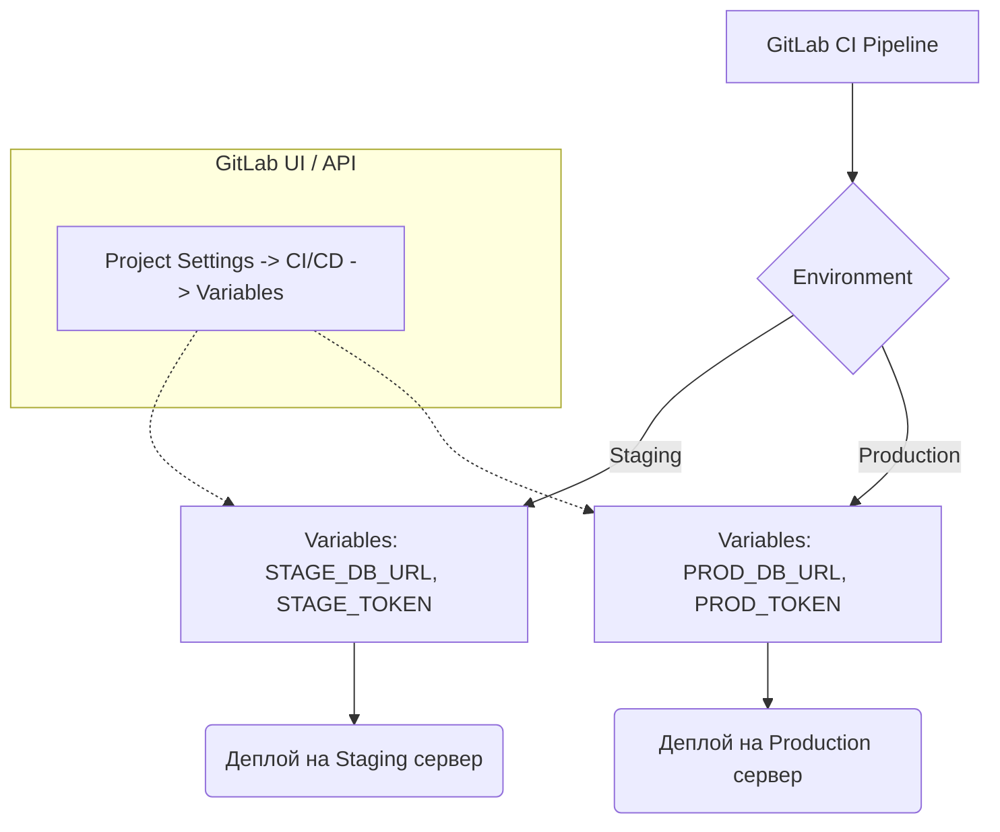

# Variables and Environments в GitLab CI

## 📖 История: От хардкода к гибким деплоям
**Боль:** В начале пути пароли от баз данных, токены для API и настройки серверов были зашиты прямо в `gitlab-ci.yml`. Когда пришло время развернуть проект не только на `production`, но и на `staging`, пришлось копировать и переписывать код. Вскоре кто-то случайно закоммитил production-ключ в публичный репозиторий...
**Решение:** GitLab CI Variables & Environments. Мы вынесли секреты в защищенные переменные (Masked & Protected), а для разных стендов настроили логические окружения (Environments). Теперь один и тот же пайплайн деплоит код по-разному в зависимости от того, куда он едет, а секреты больше не светятся в логах.

## 🏗 Архитектура и связи (Mermaid)



## 💻 Пример использования (YAML)

```yaml
stages:
  - deploy

deploy_staging:
  stage: deploy
  environment:
    name: staging
    url: https://staging.example.com
  script:
    - echo "Deploying to Staging..."
    - ./deploy.sh --db $DB_URL --token $API_TOKEN
  rules:
    - if: $CI_COMMIT_BRANCH == "develop"

deploy_production:
  stage: deploy
  environment:
    name: production
    url: https://example.com
  script:
    - echo "Deploying to Production..."
    - ./deploy.sh --db $DB_URL --token $API_TOKEN
  rules:
    - if: $CI_COMMIT_BRANCH == "main"
```
*Здесь `$DB_URL` и `$API_TOKEN` заданы в настройках GitLab с привязкой к конкретному Environment.*

## 🛠 Day 2 Operations (Эксплуатация)
- **Ротация секретов:** Регулярное обновление токенов через GitLab API или Terraform-провайдер GitLab, чтобы не делать это руками.
- **Динамические окружения (Review Apps):** Создание и удаление временных окружений для каждого Merge Request (`environment: name: review/$CI_COMMIT_REF_SLUG`). Обязательно настраивать `on_stop` для автоматической очистки ресурсов.
- **Аудит доступов:** Регулярная проверка, кто имеет доступ к изменению Protected переменных в production-окружениях.

## ⛔ Антипаттерны
- **Хранение секретов в репозитории:** Даже в зашифрованном виде (если не используется нормальный инструмент вроде SOPS), лучше держать их в Variables или внешнем Vault.
- **Отсутствие флага "Masked":** Если токен не замаскирован, он может случайно попасть в логи job'ы через команду вроде `set -x` или `env`.
- **Использование одних и тех же переменных для всех сред:** Отсутствие разделения (scoping) переменных по Environments ведет к риску задеплоить staging с production-базой.
