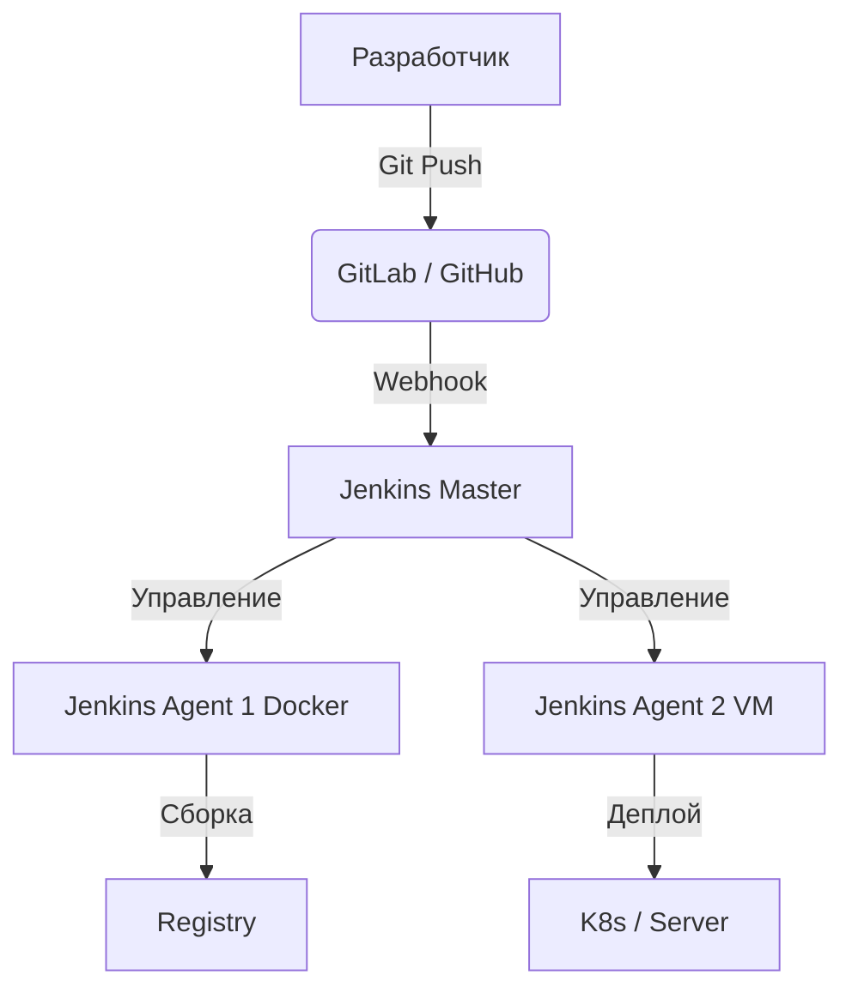

# Основы Jenkins

## 📖 История из окопов (DevOps Story)
**Боль:** Команда собирала проект локально и копировала артефакты на сервер по SSH. Забыли запустить тесты — прод упал, релиз откатывали всю ночь.
**Решение:** Внедрение Jenkins. Теперь каждый пуш в репозиторий запускает сборку, прогон тестов и деплой на тестовый контур автоматически. Никакого ручного фактора.

## 🏗 Архитектура



## 💻 Установка (Пример Docker Compose)

```yaml
version: '3.8'
services:
  jenkins:
    image: jenkins/jenkins:lts
    privileged: true
    user: root
    ports:
      - 8080:8080
      - 50000:50000
    volumes:
      - ~/jenkins_home:/var/jenkins_home
      - /var/run/docker.sock:/var/run/docker.sock
```

## 🛠 Day 2 Operations
- **Бэкапы:** Регулярное резервное копирование `/var/jenkins_home` (особенно файлов конфигурации и секретов). Можно использовать плагин ThinBackup или cron-скрипты.
- **Обновления:** Регулярное обновление Jenkins Master и плагинов. Важно тестировать обновления на staging-сервере, так как плагины часто ломают совместимость.
- **Мониторинг:** Настройка экспортеров Prometheus (Jenkins Prometheus Plugin) для отслеживания длины очереди сборок и состояния агентов.

## 🚫 Антипаттерны
- **ClickOps:** Настройка джоб и пайплайнов через веб-интерфейс (UI). Если сервер умрёт, вы потеряете всю логику сборки. Используйте Jenkins Configuration as Code (JCasC) и Jenkinsfile.
- **Heavy Master:** Запуск сборок на самом Jenkins Master. Master должен только оркестрировать. Все сборки должны уходить на агентов.
- **Монолитные плагины:** Установка 100500 плагинов "на всякий случай". Плагины — главная уязвимость и источник конфликтов в Jenkins.
