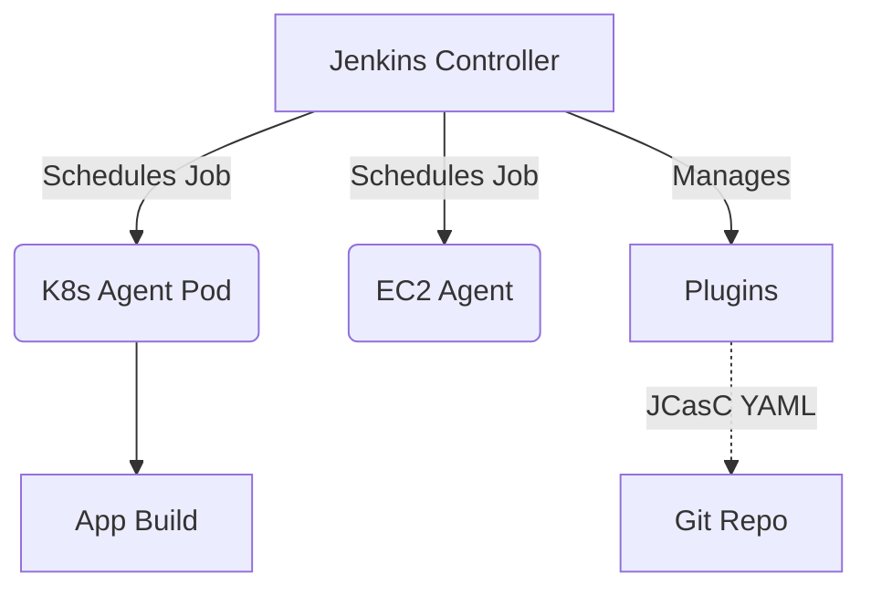

# Jenkins Agents и Plugins

## DevOps Story
**Боль:** Запуск всех сборок прямо на Jenkins Master приводит к падению сервера от нехватки памяти, а установка 100500 плагинов "на всякий случай" превращает апгрейд Jenkins в русскую рулетку.
**Решение:** Вынесение нагрузки на изолированные Agents (желательно эфемерные в Kubernetes) и использование минимально необходимого набора плагинов с управлением через JCasC (Jenkins Configuration as Code).

## Архитектура


## Пример (YAML/Groovy)

**Kubernetes Pod Template (Jenkinsfile):**
```groovy
pipeline {
    agent {
        kubernetes {
            yaml '''
            apiVersion: v1
            kind: Pod
            spec:
              containers:
              - name: maven
                image: maven:3.8.1-jdk-11
                command: ['cat']
                tty: true
            '''
        }
    }
    stages {
        stage('Build') {
            steps {
                container('maven') {
                    sh 'mvn -B clean package'
                }
            }
        }
    }
}
```

**Управление плагинами (plugins.txt):**
```text
kubernetes:3937.vd7b_82db_e347b_
workflow-job:1301.v054d9cea_9593
configuration-as-code:1647.ve39ca_b_829b_42
```

## Day 2 Operations
- **Эфемерные агенты:** Используйте Kubernetes-плагин для создания агентов "на лету" под каждую сборку. Это избавляет от проблемы "грязного" состояния (снежинок) после предыдущих билдов.
- **Автоматизация плагинов:** Устанавливайте плагины через CLI или скрипты инициализации, фиксируя точные версии.
- **Мониторинг:** Настройте Prometheus метрики для мониторинга очереди агентов и потребления ресурсов контроллером.

## Антипаттерны
- **Сборка на Controller'е (Master):** Назначение экзекуторов на `master` ноду. Это дыра в безопасности и прямой путь к отказу всей системы CI.
- **Plugin Hell:** Установка плагинов через UI без фиксации версий. Приводит к конфликтам зависимостей ("Dependency errors") при перезагрузке.
- **Статические агенты-питомцы:** Долгоживущие виртуалки с кучей установленного софта, которые никто не знает как пересоздать с нуля.
