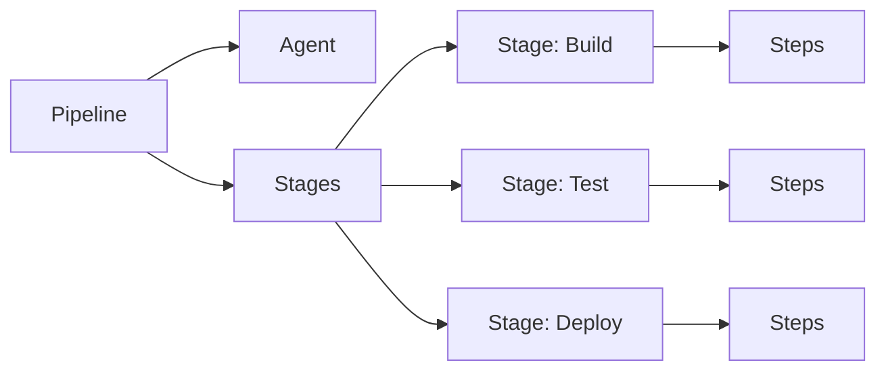

# Jenkinsfile: Declarative vs Scripted

## 📖 История из окопов (DevOps Story)
**Боль:** Команда переросла Freestyle jobs. Появилось 50 проектов, в каждом 10 шагов сборки, настроенных через UI. Когда потребовалось изменить версию Node.js, DevOps потратил неделю, кликая по интерфейсу.
**Решение:** Переход на Pipeline-as-Code (Jenkinsfile). Теперь логика сборки лежит рядом с кодом, версионируется, и изменить версию Node.js можно массовым PR.

## 🏗 Структура Declarative Pipeline



## 💻 Сравнение и примеры кода

### Declarative Pipeline (Современный стандарт, жесткая структура)
```groovy
pipeline {
    agent any
    
    environment {
        APP_ENV = 'production'
    }

    stages {
        stage('Build') {
            steps {
                echo 'Building...'
                sh 'make build'
            }
        }
        stage('Test') {
            steps {
                echo 'Testing...'
                sh 'make test'
            }
        }
    }
    
    post {
        always {
            cleanWs()
        }
    }
}
```

### Scripted Pipeline (Legacy/Гибкий, на базе Groovy)
```groovy
node('master') {
    def appEnv = 'production'
    
    try {
        stage('Build') {
            echo "Building..."
            sh "make build"
        }
        stage('Test') {
            echo "Testing..."
            sh "make test"
        }
    } catch (Exception e) {
        currentBuild.result = 'FAILURE'
        throw e
    } finally {
        cleanWs()
    }
}
```

## 🛠 Day 2 Operations
- **Shared Libraries:** Вынесение повторяющегося кода пайплайнов (например, нотификации в Slack или деплой в Helm) в общие библиотеки Jenkins Shared Libraries, чтобы избежать дублирования в десятках репозиториев.
- **Линтинг:** Использование Jenkins Pipeline Linter API перед коммитом для проверки синтаксиса Jenkinsfile (можно встроить в pre-commit хуки).
- **Оптимизация агентов:** Использование динамических агентов (Kubernetes pod templates), чтобы агенты поднимались только на время выполнения пайплайна.

## 🚫 Антипаттерны
- **Вся логика в Jenkinsfile:** Написание сложных bash-скриптов или логики компиляции прямо внутри шагов `sh`. Лучше вынести это в `Makefile` или `build.sh`, чтобы можно было запустить локально без Jenkins.
- **Использование Scripted Pipeline для простых задач:** Scripted даёт гибкость, но усложняет чтение и поддержку. Всегда начинайте с Declarative, и переходите на Scripted (или Shared Libraries) только если не хватает возможностей.
- **Отсутствие Post-действий:** Оставление мусора в Workspace после сборки (не использование `cleanWs()`).
