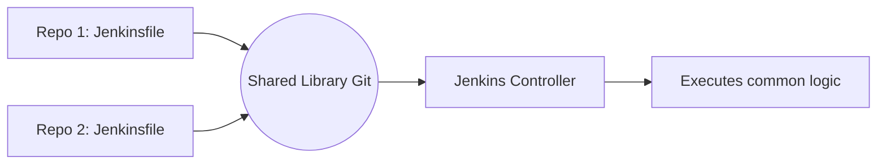

# Jenkins Shared Libraries

## DevOps Story
**Боль:** Копипаста одного и того же куска пайплайна (сборка, тесты, деплой) в 50 разных репозиториев. Если нужно поменять версию SonarQube, приходится делать 50 PR.
**Решение:** Jenkins Shared Libraries. Выносим общий код пайплайнов в отдельный Git-репозиторий и переиспользуем его как функции.

## Архитектура


## Пример (Groovy/Jenkinsfile)

**Структура Shared Library:**
```text
(root)
+- src/org/foo/Zot.groovy  # Utility classes
+- vars/buildApp.groovy    # Global variables/functions
```

**vars/buildApp.groovy:**
```groovy
def call(Map config) {
    pipeline {
        agent any
        stages {
            stage('Build') {
                steps {
                    sh "echo Building ${config.appName}..."
                }
            }
        }
    }
}
```

**Jenkinsfile в проекте:**
```groovy
@Library('my-shared-library') _
buildApp(appName: 'frontend-service')
```

## Day 2 Operations
- **Версионирование:** Всегда привязывайте версию библиотеки в Jenkinsfile (`@Library('my-shared-library@v1.0') _`), чтобы изменения в `master` библиотеки не сломали все пайплайны разом.
- **Тестирование:** Используйте фреймворки вроде Jenkins Spock для юнит-тестирования Groovy-кода пайплайнов перед деплоем.

## Антипаттерны
- **God Object:** Попытка засунуть всю логику компании в одну огромную функцию `doEverything()`, которую невозможно параметризовать.
- **Отсутствие версионирования:** Использование ветки `master` по умолчанию. Одно кривое слияние ломает релизы всей компании.
- **Тяжелые вычисления в vars:** Выполнение сложных shell-команд или HTTP-запросов на мастере (в Groovy коде), а не внутри шага `sh` на агенте.
