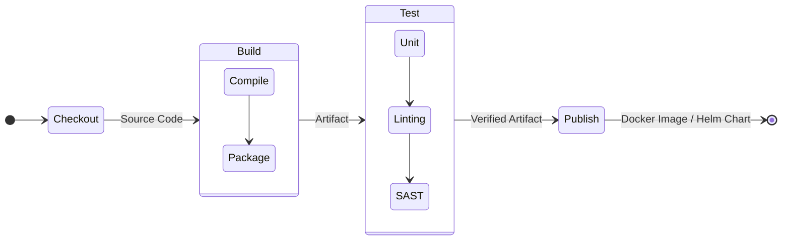

# Pipeline Design

## 📖 DevOps-история: Решение боли
**Боль:** Автоматизация сборки состояла из гигантского `build.sh` скрипта на 2000 строк. Он выполнял всё: от скачивания библиотек до деплоя. Когда падал один этап, было непонятно где, скрипт нельзя было перезапустить с середины, а изменения в нём ломали всё приложение.
**Решение:** Пайплайн как код (Pipeline as Code). Разбиение процесса на независимые, идемпотентные этапы (Stages), каждый из которых выполняет ровно одну функцию (Сборка -> Тесты -> Анализ безопасности -> Публикация).

## 🧩 Ключевые компоненты дизайна
- **Модульность:** Разделение на логические шаги (Jobs).
- **Изоляция:** Запуск шагов в чистых эфемерных окружениях (обычно Docker-контейнерах).
- **Пайплайн как код:** Конфигурация хранится в репозитории вместе с кодом (например, `.gitlab-ci.yml`).

## 📊 Структура Pipeline



## 💻 Пример: Модульный скрипт / YAML (GitLab CI)

```yaml
stages:
  - build
  - test
  - publish

# Базовый темплейт
.docker-setup:
  image: docker:24.0.5
  services:
    - docker:24.0.5-dind

build-app:
  stage: build
  extends: .docker-setup
  script:
    - echo "Building image..."
    - docker build -t myapp:$CI_COMMIT_SHA .
  artifacts:
    reports:
      dotenv: build.env

test-app:
  stage: test
  image: golang:1.21
  script:
    - go test ./... -v
  cache:
    key: go-modules
    paths:
      - .go/pkg/mod/

publish-image:
  stage: publish
  extends: .docker-setup
  script:
    - docker push myapp:$CI_COMMIT_SHA
  only:
    - master
```

## 🛠 Day 2 Operations (Эксплуатация)
- **Управление зависимостями пайплайна (Shared Libraries):** Вынесение общего кода (например, отправка уведомлений в Slack или деплой в K8s) в переиспользуемые шаблоны, чтобы не дублировать код в сотнях репозиториев.
- **Очистка артефактов:** Настройка политик хранения (Retention policies) для собранных образов и кэшей, чтобы не переполнить диск раннеров.
- **Тюнинг раннеров:** Автомасштабирование CI-агентов (Runners) в облаке или K8s в пиковые часы нагрузки (утро/день) и схлопывание ночью для экономии.

## 🚫 Антипаттерны
- **Монолитный Job:** Выполнение сборки, тестов и пуша в одном шаге. При падении тестов придется пересобирать всё заново.
- **Сайд-эффекты:** Пайплайн меняет состояние внешних систем (например, пишет в прод БД) на этапе тестов.
- **Зависимость от конкретного раннера:** Скрипт требует специфичных утилит, установленных "руками" на сервере `jenkins-worker-01`, вместо использования Docker-образов.
