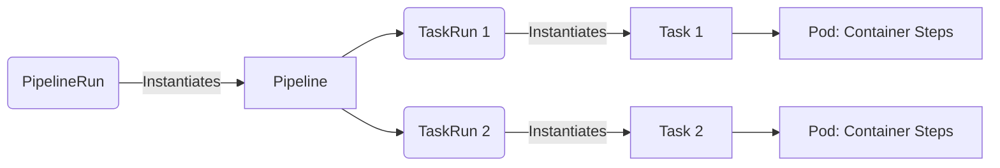

# Tekton

## История боли (DevOps Story)
По мере того как Kubernetes становился стандартом де-факто, появилась сильная потребность в стандартизированном, декларативном способе описания CI/CD-пайплайнов, который работал бы как родные ресурсы кластера. Существующие решения были "внешними", требовали собственных баз данных, серверов и сложной интеграции с K8s.
**Решение:** Tekton Pipelines родился как набор CRD (Custom Resource Definitions) для K8s. Он позволил строить пайплайны полностью внутри кластера. В Tekton таски (Tasks) и пайплайны (Pipelines) — это просто ресурсы Kubernetes, которые можно переиспользовать, версионировать и легко шарить между командами через Tekton Hub.

## Архитектура



## Примеры

### CLI (bash)
```bash
# Запуск пайплайна с использованием tkn CLI и провижининг воркспейса
tkn pipeline start build-and-deploy \
    --workspace name=shared-workspace,volumeClaimTemplateFile=pvc.yaml \
    --showlog

# Просмотр логов последнего запуска пайплайна
tkn pipelinerun logs --last
```

### YAML (Task)
```yaml
apiVersion: tekton.dev/v1beta1
kind: Task
metadata:
  name: hello-tekton
spec:
  steps:
    - name: echo
      image: ubuntu
      command:
        - echo
      args:
        - "Hello World from Tekton!"
```

## Day 2 Operations
- **Очистка ресурсов (Pruning):** Регулярная очистка старых `TaskRuns` и `PipelineRuns`. Поскольку они накапливаются как объекты K8s, они могут замедлять API Server.
- **Безопасность (Security Context):** Настройка запуска шагов не от root, ограничение привилегий через Pod Security Admission или OPA Gatekeeper.
- **Управление артефактами и Supply Chain Security:** Интеграция с внешними хранилищами (OCI registries) и использование Tekton Chains для автоматического подписывания образов и генерации SBOM (Software Bill of Materials).

## Антипаттерны
- **Дублирование Task'ов (Reinventing the wheel):** Написание собственных тасок для стандартных операций (git-clone, kaniko, helm) вместо использования проверенных из Tekton Hub.
- **Сложная логика в bash-шагах:** Использование огромных, нечитаемых bash-скриптов прямо внутри YAML-определения (лучше выносить сложную логику в отдельные контейнерные образы или скрипты в репозитории).
- **Глобальные статические PVC:** Использование одного огромного статического PersistentVolume для всех пайплайнов вместо динамического провижининга через Workspaces и `VolumeClaimTemplates`.
