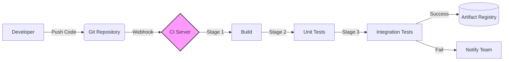

# Принципы CI (Continuous Integration)

## 📖 DevOps-история: Решение боли
**Боль:** Разработчики пишут код локально неделями ("у меня всё работает!"), а затем пытаются слить его в `master` перед релизом. Начинается "интеграционный ад": конфликты версий, сломанные зависимости, и никто не знает, чей именно коммит всё сломал.
**Решение:** Непрерывная интеграция. Код сливается в основную ветку мелкими порциями несколько раз в день. Каждое изменение автоматически собирается и тестируется. Ошибка выявляется моментально.

## 🏗 Принципы
1. **Единый репозиторий исходного кода:** Всё, что нужно для сборки, должно быть в Git.
2. **Автоматизация сборки:** Сборка должна происходить по одной команде.
3. **Ежедневные коммиты:** Разработчики должны интегрировать код каждый день.
4. **Быстрые билды:** Если CI занимает часы, разработчики перестанут его ждать.
5. **Тестирование в клоне продакшена:** Среда тестирования должна быть максимально близка к боевой.

## 📊 Архитектура CI



## 💻 Пример (GitHub Actions YAML)

```yaml
name: CI Pipeline
on: [push, pull_request]

jobs:
  build-and-test:
    runs-on: ubuntu-latest
    steps:
      - name: Checkout code
        uses: actions/checkout@v3
        
      - name: Setup Node.js
        uses: actions/setup-node@v3
        with:
          node-version: '18'
          
      - name: Install dependencies
        run: npm ci
        
      - name: Run tests
        run: npm test
```

## 🛠 Day 2 Operations (Эксплуатация)
- **Борьба с Flaky Tests (Мерцающими тестами):** Регулярный аудит тестов, которые то проходят, то падают. Их нужно либо чинить, либо удалять, иначе доверие к CI пропадает.
- **Оптимизация времени:** Внедрение кэширования зависимостей (npm, maven, go mod) и распараллеливание джобов.
- **Ротация секретов:** Регулярное обновление токенов, используемых CI-сервером.

## 🚫 Антипаттерны
- **Long-lived branches (Долгоживущие ветки):** Накопление изменений в ветке `feature` неделями, что делает мердж невозможным.
- **Ночные сборки (Nightly builds):** Сборка происходит только ночью. Разработчик узнает об ошибке на следующий день, когда контекст уже утерян.
- **Игнорирование упавших билдов:** "Красный" пайплайн становится нормой. Команда должна бросать всё и чинить `master`.