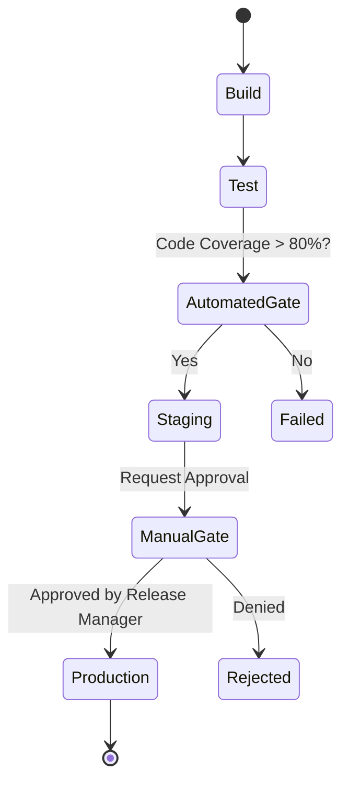

# Approval Gates

## История (Боль -> Решение)
**Боль:** Релизы выкатываются в Production с багами, потому что никто не проверил результаты автотестов, или QA забыл дать отмашку. Деплой происходит хаотично.
**Решение:** Внедрение Approval Gates — автоматических и ручных проверок на критических этапах пайплайна. Код не пойдет в Production, пока не соберет нужные метрики качества (Quality Gates) или не получит апрув от менеджера/релиз-инженера.

## Архитектура


## Примеры

### YAML (GitHub Actions - Manual Approval)
```yaml
name: Deploy to Production
on:
  push:
    branches:
      - main

jobs:
  deploy_prod:
    runs-on: ubuntu-latest
    environment: 
      name: production
      # Требует ручного подтверждения от ревьюеров, настроенных в Github Settings -> Environments
    steps:
      - name: Deploy Script
        run: echo "Deploying to production..."
```

### Bash (Автоматический Quality Gate с SonarQube)
```bash
#!/bin/bash
PROJECT_KEY="my_project"
SONAR_URL="https://sonar.example.com"
TOKEN=$SONAR_TOKEN

STATUS=$(curl -s -u $TOKEN: "$SONAR_URL/api/qualitygates/project_status?projectKey=$PROJECT_KEY" | jq -r '.projectStatus.status')

if [ "$STATUS" = "ERROR" ]; then
    echo "Quality Gate failed!"
    exit 1
elif [ "$STATUS" = "OK" ]; then
    echo "Quality Gate passed."
    exit 0
else
    echo "Unknown status: $STATUS"
    exit 1
fi
```

## Day 2 Operations
- **SLA на апрувы:** Мониторинг времени, которое релиз ждет подтверждения. Долгие апрувы = бутылочное горлышко.
- **Автоматизация политик (Policy as Code):** Использование OPA (Open Policy Agent) для проверки, соответствует ли деплой корпоративным стандартам безопасности, прежде чем просить ручной апрув.
- **Оповещения:** Интеграция с Slack/Teams для мгновенного уведомления ответственных лиц о том, что требуется их апрув.

## Антипаттерны
- **Кабальные апрувы:** Требование апрува от CEO или человека, который никогда не бывает на месте, для каждого мелкого релиза.
- **Резиновая печать (Rubber-stamping):** Апруверы нажимают "Approve" не глядя на изменения и метрики.
- **Отсутствие эскейп-хэтча:** Нет механизма экстренного деплоя (hotfix/break-glass) в обход стандартных долгих гейтов при критической аварии.
