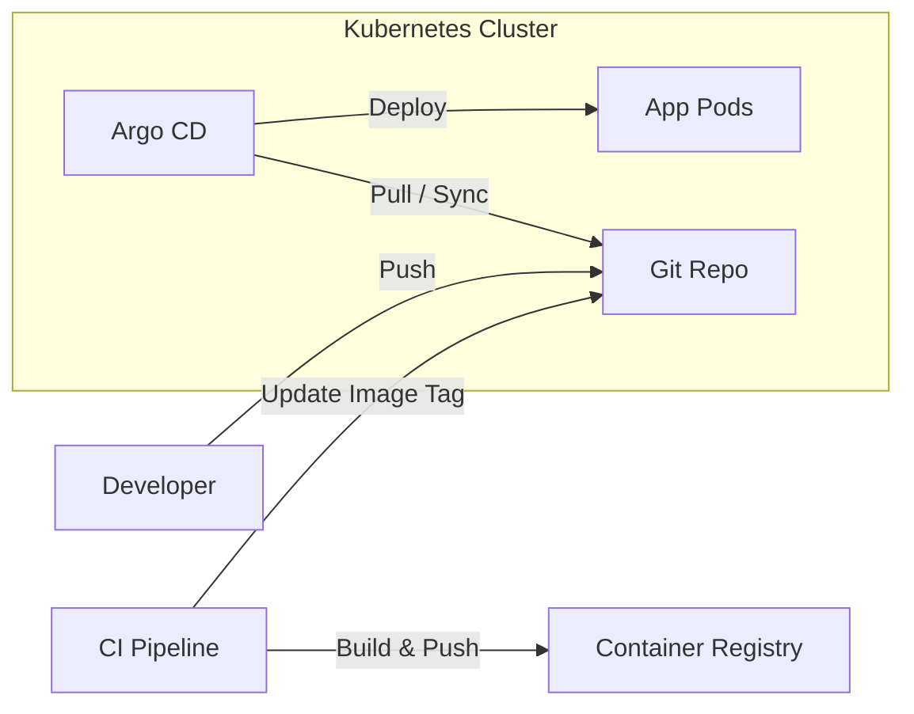

# Argo CD

## 📖 История боли (DevOps Story)
**Боль:** Команды деплоили приложения вручную через `kubectl apply -f`, используя CI пайплайны. Из-за этого состояние кластера часто расходилось с Git (drift), было сложно откатываться, а доступы к кластеру (kubeconfig) приходилось раздавать CI-серверам (Jenkins/GitLab CI), что является серьезной уязвимостью в безопасности.
**Решение:** Argo CD реализует паттерн GitOps. Он постоянно следит за Git-репозиторием и автоматически синхронизирует состояние Kubernetes-кластера с манифестами в Git. CI только собирает образы, а Argo (pull model) вытягивает изменения. Кластер закрыт извне.

## 📐 Архитектура (Mermaid)



## 💻 Примеры (YAML / Bash)

**Установка:**
```bash
kubectl create namespace argocd
kubectl apply -n argocd -f https://raw.githubusercontent.com/argoproj/argo-cd/stable/manifests/install.yaml
```

**Application CRD (Декларативное описание приложения):**
```yaml
apiVersion: argoproj.io/v1alpha1
kind: Application
metadata:
  name: my-app
  namespace: argocd
spec:
  project: default
  source:
    repoURL: 'https://github.com/my-org/my-app-manifests.git'
    path: k8s
    targetRevision: HEAD
  destination:
    server: 'https://kubernetes.default.svc'
    namespace: my-app-ns
  syncPolicy:
    automated:
      prune: true
      selfHeal: true
```

## 🛠 Day 2 Operations
- **Управление секретами:** Argo CD сам по себе не шифрует секреты. Интегрируйте его с **Sealed Secrets**, **External Secrets Operator** (AWS Secrets Manager, HashiCorp Vault) или **SOPS**.
- **Мультикластерность:** Argo CD может управлять несколькими кластерами из одного инстанса. Добавляйте внешние кластеры через CLI `argocd cluster add <context-name>`.
- **DR (Disaster Recovery):** В идеале сам Argo CD должен быть развернут через GitOps (App of Apps паттерн). Резервное копирование самого Argo CD (настройки, проекты) можно делать через экспорт манифестов.

## 🚫 Антипаттерны
- **Хранение секретов в plain-text в Git:** Никогда не коммитьте обычные `Kind: Secret` в репозиторий, за которым следит Argo CD.
- **Смешивание кода и манифестов:** Хранение манифестов Kubernetes в том же репозитории, что и исходный код приложения. Это приводит к бесконечным циклам CI при каждом коммите манифеста. **Правильно:** Использовать отдельный репозиторий для инфраструктуры/манифестов.
- **Push из CI напрямую в кластер:** Использование Argo CD как тупой "обертки", при этом продолжая делать `kubectl apply` из CI-пайплайнов в обход Argo.
