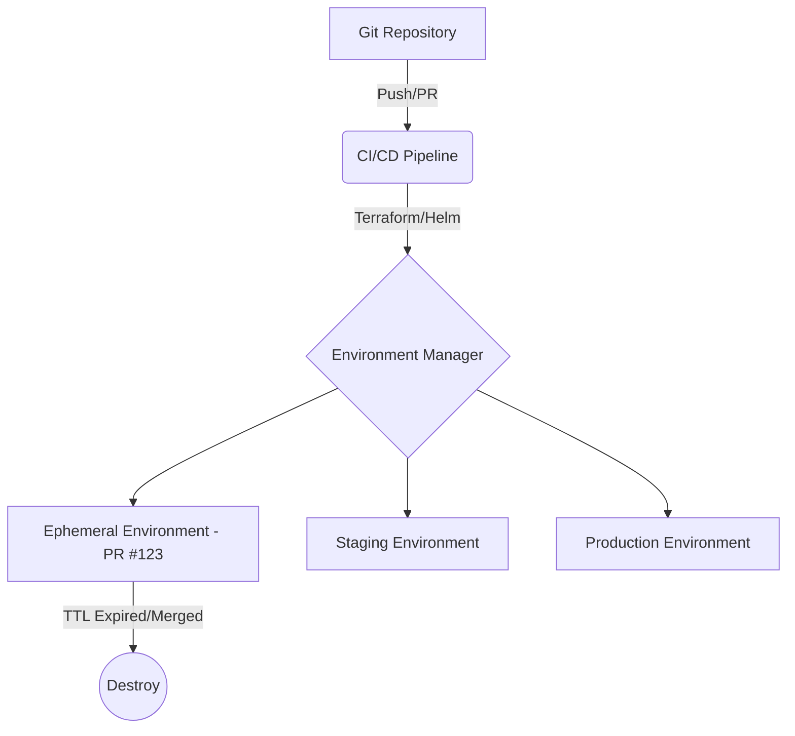

# Environment Management

## История (Боль -> Решение)
**Боль:** Разработчики ждут неделями выделения тестового стенда. Конфигурации сред (Dev, Staging, Prod) расползаются, что приводит к классической проблеме "на моей машине всё работает".
**Решение:** Infrastructure as Code (IaC) и динамические окружения. Среды создаются по требованию (например, на каждый Pull Request) и уничтожаются после мерджа, а конфигурация версионируется в Git.

## Архитектура


## Примеры

### YAML (GitLab CI для динамического окружения)
```yaml
deploy_review:
  stage: deploy
  script:
    - helm upgrade --install review-${CI_COMMIT_REF_SLUG} ./chart --set ingress.host=${CI_COMMIT_REF_SLUG}.example.com
  environment:
    name: review/${CI_COMMIT_REF_SLUG}
    url: https://${CI_COMMIT_REF_SLUG}.example.com
    on_stop: stop_review
  rules:
    - if: $CI_PIPELINE_SOURCE == "merge_request_event"

stop_review:
  stage: deploy
  script:
    - helm uninstall review-${CI_COMMIT_REF_SLUG}
  environment:
    name: review/${CI_COMMIT_REF_SLUG}
    action: stop
  rules:
    - if: $CI_MERGE_REQUEST_EVENT_TYPE == "close" || $CI_MERGE_REQUEST_EVENT_TYPE == "merge"
      when: manual
```

### Bash (Очистка старых ресурсов по TTL)
```bash
# Удаление namespace старше 7 дней
kubectl get namespaces -l environment=ephemeral -o jsonpath='{range .items[*]}{.metadata.name}{"\t"}{.metadata.creationTimestamp}{"\n"}{end}' | while read ns created; do
    created_s=$(date -d "$created" +%s)
    now_s=$(date +%s)
    age_days=$(( (now_s - created_s) / 86400 ))
    if [ "$age_days" -gt 7 ]; then
        echo "Deleting namespace $ns (Age: $age_days days)"
        kubectl delete namespace "$ns"
    fi
done
```

## Day 2 Operations
- **Cost Allocation:** Тегирование ресурсов для биллинга (кто сколько потратил на свои тестовые стенды).
- **Security Audits:** Регулярная проверка IAM прав для скриптов, создающих окружения (принцип наименьших привилегий).
- **Drift Detection:** Периодический запуск `terraform plan` для выявления ручных изменений (Configuration Drift).

## Антипаттерны
- **Снежинки (Snowflake Environments):** Окружения, настроенные вручную. Их невозможно воспроизвести с нуля.
- **Общий Staging:** Использование одного стенда всеми командами одновременно (приводит к блокировкам и грязным данным).
- **Жестко зашитые креды:** Хранение секретов для разных сред прямо в коде, а не в Vault/Secret Manager.
