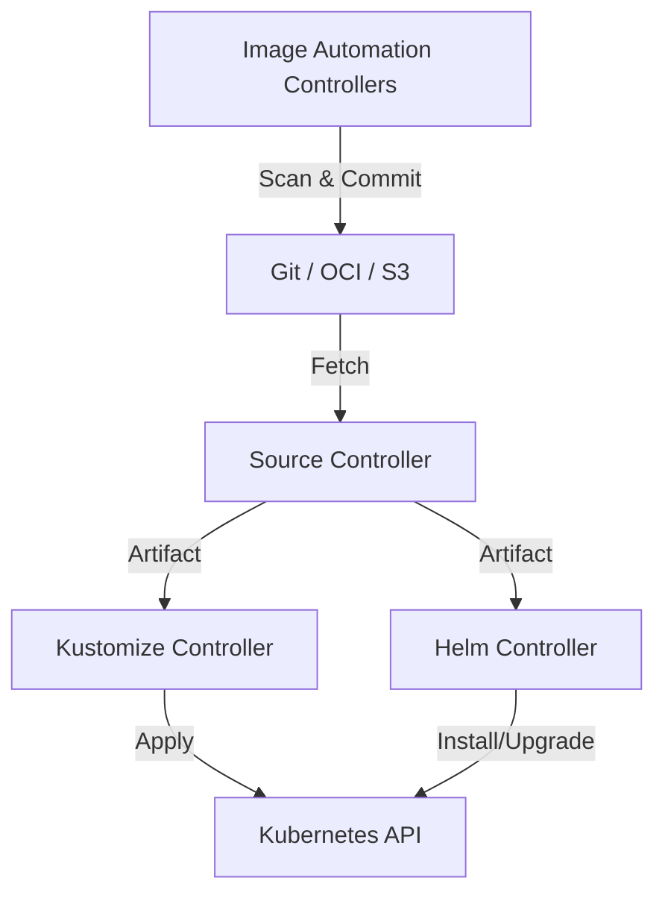

# Flux CD

## 📖 История боли (DevOps Story)
**Боль:** Необходимость поддерживать инфраструктуру в консистентном состоянии без тяжеловесных UI-решений. Команде нужен был легковесный, модульный GitOps-агент, который глубоко интегрирован с Kubernetes API и поддерживает сложные сценарии доставки (Kustomize, Helm), работу с несколькими источниками (Git, OCI, S3 bucket), при этом потребляя минимум ресурсов.
**Решение:** Flux CD (v2) предоставляет набор Kubernetes-контроллеров (Source, Kustomize, Helm, Notification). Это позволяет собирать пайплайны доставки из "кубиков" прямо внутри K8s. Идеально подходит для автоматизации обновлений образов, управления конфигурациями и развертывания мульти-тенантных кластеров.

## 📐 Архитектура (Mermaid)



## 💻 Примеры (YAML / Bash)

**Установка (Bootstrap):**
```bash
flux bootstrap github \
  --owner=my-github-org \
  --repository=fleet-infra \
  --branch=main \
  --path=./clusters/my-cluster \
  --personal
```

**GitRepository и Kustomization (Декларативное развертывание):**
```yaml
apiVersion: source.toolkit.fluxcd.io/v1beta2
kind: GitRepository
metadata:
  name: podinfo
  namespace: flux-system
spec:
  interval: 1m
  url: https://github.com/stefanprodan/podinfo
  ref:
    branch: master
---
apiVersion: kustomize.toolkit.fluxcd.io/v1beta2
kind: Kustomization
metadata:
  name: podinfo
  namespace: flux-system
spec:
  interval: 5m
  path: "./kustomize"
  prune: true
  sourceRef:
    kind: GitRepository
    name: podinfo
```

## 🛠 Day 2 Operations
- **Автоматизация обновления образов:** Flux умеет следить за Container Registry и, при появлении нового тега (например, по semver), автоматически коммитить изменение в ваш Git-репозиторий и выкатывать его (Image Update Automation).
- **Мониторинг:** Встроенная интеграция с Prometheus и Grafana. Flux генерирует метрики по всем reconciliation циклам. Настройка алертов через Notification Controller возможна в Slack/MS Teams.
- **Flagger:** Использование Flagger (часть экосистемы Flux) для прогрессивной доставки (Canary, A/B testing, Blue/Green) с автоматическим анализом метрик перед переключением трафика.

## 🚫 Антипаттерны
- **Создание огромного монолитного Kustomization:** Когда один `Kustomization` объект управляет всем кластером. Это приводит к тому, что ошибка в одном месте блокирует обновление всего остального. Лучше дробить на микро-кастомизации.
- **Игнорирование таймингов (`interval`):** Установка слишком маленьких интервалов (например, 1 секунда) для `GitRepository` или `HelmRelease` может привести к rate limit-ам на стороне Git-провайдера (GitHub/GitLab) или перегрузить kube-apiserver.
- **Ручные правки в кластере:** Изменение ресурсов, управляемых Flux, напрямую через `kubectl edit`. Flux автоматически откатит ваши изменения при следующем reconciliation (при включенном self-heal), вызывая недопонимание у инженеров, не знакомых с GitOps.
