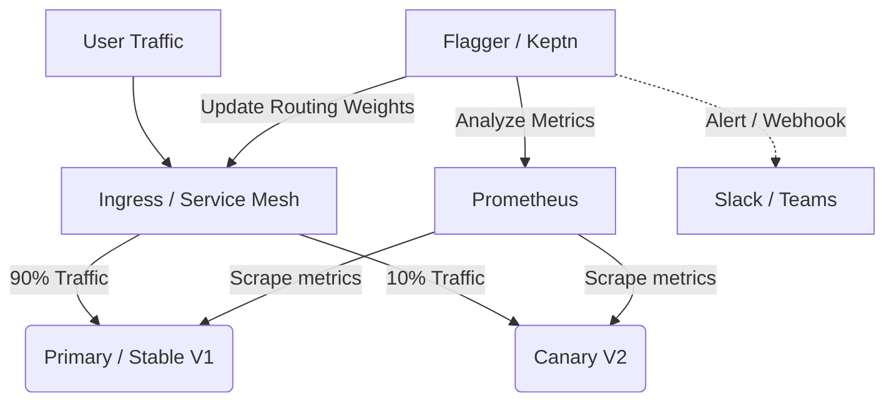

# Progressive Delivery (Flagger, Keptn)

## История: Боль Big Bang релизов
**Боль:** Классический CI/CD выкатывает новую версию на всех пользователей сразу (Big Bang). Если в коде критический баг, ложится весь прод, бизнес теряет деньги, а инженеры седеют, пытаясь откатиться под давлением инцидента.
**Решение:** Progressive Delivery. Мы направляем на новую версию малую часть трафика (например, 5%). Если метрики (ошибки, задержки) в норме — постепенно увеличиваем до 100%. Если что-то идет не так — система *автоматически* возвращает трафик на стабильную версию.

## Как это работает (Архитектура)



## Пример YAML (Flagger Canary)

```yaml
apiVersion: flagger.app/v1beta1
kind: Canary
metadata:
  name: my-app
  namespace: prod
spec:
  # Deployment to target
  targetRef:
    apiVersion: apps/v1
    kind: Deployment
    name: my-app
  # Ingress / Mesh routing
  service:
    port: 8080
  # Progressive delivery analysis
  analysis:
    interval: 1m
    threshold: 5 # Максимум 5 провалов перед откатом
    maxWeight: 50
    stepWeight: 10
    metrics:
    - name: request-success-rate
      thresholdRange:
        min: 99 # Минимум 99% успешных HTTP запросов
      interval: 1m
    - name: request-duration
      thresholdRange:
        max: 500 # Максимум 500ms latency
      interval: 30s
```

## Day 2 Operations (Обслуживание)
* **Настройка Baseline:** Метрики Canary нужно сравнивать не со статичными лимитами, а со стабильной версией (Baseline), чтобы исключить влияние общих сетевых спайков.
* **Tuning таймингов:** Слишком быстрая раскатка не успевает собрать метрики, слишком медленная — забивает пайплайн релизов.
* **Webhooks:** Интеграция с нагрузочным тестированием перед тем, как пустить реальных пользователей (Flagger webhooks для запуска тестов).

## Антипаттерны
* **Progressive Delivery без наблюдаемости:** Использование канареек без настроенного Prometheus/Datadog. Без метрик автоматика слепа.
* **Игнорирование базы данных:** Раскатка приложения без учета обратной совместимости схемы БД. Откат трафика не откатит миграции.
* **Big Bang под видом Canary:** Установка шагов 0% -> 50% -> 100% за 1 минуту. Это не progressive delivery, а рулетка.
