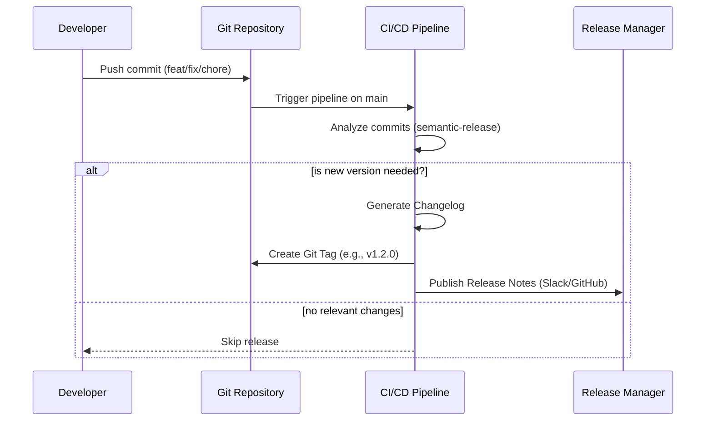

# Release Management и Notes

## История из жизни (Боль и Решение)
**Боль:** Каждую пятницу релиз-менеджер тратит 2 часа, собирая тикеты из Jira и коммиты из Git, чтобы понять, что вошло в сборку. Бизнес постоянно спрашивает: «А фича X уже на проде?». Часто забывают упомянуть багфиксы, а ченджлог пишется руками и расходится с реальностью.
**Решение:** Автоматизация генерации Release Notes на основе Conventional Commits. Переход на Semantic Release (или Release Please). Теперь коммиты вида `feat: add login` автоматически формируют Changelog, создают тег и релиз в GitHub/GitLab.

## Схема процесса (Mermaid)



## Примеры конфигурации

### Автогенерация релизов (GitHub Actions YAML)
Пример использования `release-please` для автоматического создания PR с релизом:
```yaml
name: Release Please
on:
  push:
    branches:
      - main
jobs:
  release-please:
    runs-on: ubuntu-latest
    steps:
      - uses: google-github-actions/release-please-action@v3
        with:
          release-type: node
          package-name: my-app
```

### Скрипт валидации коммитов (Bash / Git Hook)
```bash
#!/bin/bash
# commit-msg hook
COMMIT_MSG_FILE=$1
PATTERN="^(feat|fix|docs|style|refactor|perf|test|chore)(\(.+\))?: .+"

if ! grep -qE "$PATTERN" "$COMMIT_MSG_FILE"; then
  echo "Ошибка: Сообщение коммита не соответствует Conventional Commits."
  echo "Пример: feat: add user login"
  exit 1
fi
```

## Day 2 Operations (Обслуживание)
* **Исправление сломанных тегов:** Если тег проставлен ошибочно, его нужно удалить как локально, так и в remote (`git push --delete origin v1.2.0`). После этого необходимо почистить старые артефакты в Registry.
* **Backporting:** Перенос критичных security-фиксов из ветки `main` в старые релизные ветки (например, `release/v1.x`) с помощью `git cherry-pick` и перевыпуск минорной/патч версии.
* **Оповещения:** Интеграция пайплайна с мессенджерами (Slack/Telegram) для уведомления команды саппорта о выходе новой версии.

## Антипаттерны
1. **Ручной Changelog:** Редактирование `CHANGELOG.md` руками перед каждым релизом. Приводит к конфликтам при слиянии веток.
2. **Неинформативные коммиты:** Сообщения вида `fix bugs`, `WIP`, `update`. Они ломают автоматическую генерацию Release Notes.
3. **Отсутствие связи с трекером:** Не указывать ID задачи (например, `PROJ-123`) в коммите. Бизнесу непонятны технические описания без привязки к тикетам.
4. **Релиз в пятницу вечером (Read-only Friday):** Запуск автоматического релиза перед выходными без дежурных на смене.
