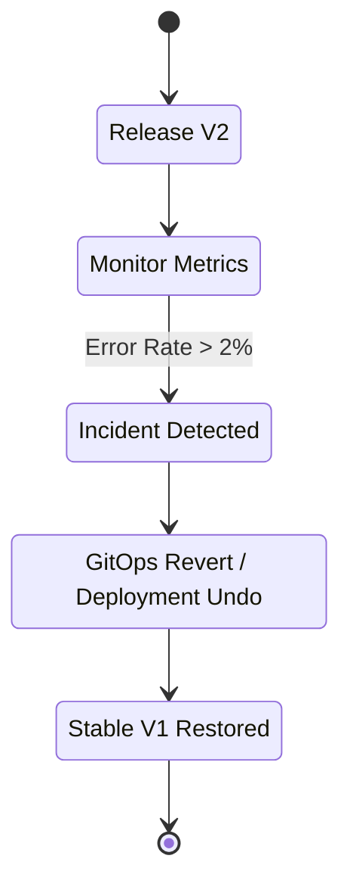

# Rollback (Откаты)

## История: Ночной инцидент
**Боль:** Релиз прошел успешно, но через час выясняется, что корзина покупок не работает. Дежурный в панике пытается понять, какой коммит был до этого, вручную запускает старые джобы в Jenkins или правит теги образов в Kubernetes через `kubectl edit`. Время идет (MTTR растет), ошибки копятся.
**Решение:** Автоматизированный, декларативный Rollback. Возврат к стабильной версии должен быть однокнопочным (или вообще автоматическим) и опираться на неизменяемые артефакты.

## Механизмы отката



## Инструменты и примеры

### Kubernetes Deployment Rollback (Императивно)
В экстренной ситуации, если нет GitOps:
```bash
# Посмотреть историю деплоев
kubectl rollout history deployment/my-app

# Откатиться на предыдущую ревизию
kubectl rollout undo deployment/my-app

# Откатиться на конкретную ревизию
kubectl rollout undo deployment/my-app --to-revision=3
```

### Helm Rollback
```bash
# История релизов helm
helm history my-app -n prod

# Откат на 2-ю ревизию
helm rollback my-app 2 -n prod
```

### GitOps Rollback (Декларативно - ArgoCD/Flux)
Правильный подход: откатываем коммит в Git, а CD-инструмент сам приводит кластер в нужное состояние.
```bash
# Revert последнего коммита в main
git revert HEAD
git commit -m "Rollback release due to checkout errors"
git push origin main
# ArgoCD автоматически засинкает стабильное состояние
```

## Day 2 Operations
* **Авто-откаты (Auto-rollback):** Настройка ArgoCD Rollouts или Flagger для автоматического отката при срабатывании алертов.
* **Управление состоянием БД:** Самая сложная часть отката. Код откатить легко, а удаленные или измененные колонки в БД — нет. Требуется паттерн Expand-Contract для миграций.
* **Пост-мортемы:** Каждый откат должен приводить к написанию Post-mortem для выявления корневой причины (Root Cause).

## Антипаттерны
* **Rollback через Roll-forward без тестирования:** Попытка быстро написать "hotfix", сбилдить и выкатить в прод вместо отката к стабильной версии. Часто приводит к новым багам.
* **Мутирующие теги Docker:** Использование `latest` тегов для образов. Если тег был перезаписан, откат инфраструктуры скачает тот же самый сломанный образ.
* **Ручное вмешательство:** Редактирование ресурсов напрямую в проде (`kubectl edit`) вместо отката через систему контроля версий (GitOps).
