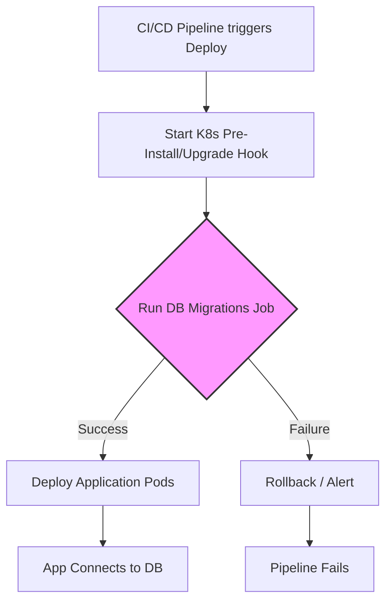

# Миграции БД в деплое

## История из жизни (Боль и Решение)
**Боль:** Новая версия приложения выкатывается быстрее, чем администратор успевает вручную накатить SQL-скрипты. Приложение стартует, пытается выполнить `SELECT` к новой колонке, падает с ошибкой 500, клиенты в ярости. Другой сценарий: ORM (например, Hibernate) настроен на автоматическое обновление схемы при старте приложения, и 5 подов одновременно пытаются изменить таблицу, вызывая дедлоки.
**Решение:** Разделение деплоя приложения и миграции БД. Использование специализированных утилит (Flyway, Liquibase, Alembic) в виде идемпотентных Job (например, Kubernetes Job или Helm Pre-Install Hook), которые блокируют запуск приложения до успешного обновления схемы.

## Схема процесса (Mermaid)



## Примеры конфигурации

### Kubernetes Job для миграций (YAML / Helm Hook)
```yaml
apiVersion: batch/v1
kind: Job
metadata:
  name: {{ .Release.Name }}-db-migration
  annotations:
    # Гарантирует запуск до деплоя Deployment'а
    "helm.sh/hook": pre-install,pre-upgrade
    "helm.sh/hook-delete-policy": before-hook-creation,hook-succeeded
spec:
  template:
    spec:
      containers:
        - name: flyway
          image: flyway/flyway:9-alpine
          command: ["flyway", "-url=jdbc:postgresql://db:5432/app", "-user=admin", "-password=secret", "migrate"]
      restartPolicy: Never
  backoffLimit: 1
```

### Пример безопасной миграции (SQL)
```sql
-- V2__Add_email_to_users.sql
-- Идемпотентное добавление колонки без блокировки таблицы на долгое время
ALTER TABLE users ADD COLUMN IF NOT EXISTS email VARCHAR(255);
CREATE INDEX CONCURRENTLY IF NOT EXISTS idx_users_email ON users(email);
```

## Day 2 Operations (Обслуживание)
* **Разрешение конфликтов и локов:** Если миграция упала посередине, утилиты вроде Flyway могут заблокировать таблицу версий. Требуется ручной запуск `flyway repair`, чтобы снять лок и удалить запись о неудачной транзакции.
* **Откат (Rollback):** Написание `down`-миграций (rollback скриптов) на каждую `up`-миграцию. При откате приложения нужно также откатить и БД, если это безопасно.
* **Мониторинг долгих запросов:** Отслеживание времени выполнения миграций через APM/метрики. Тяжелые `ALTER TABLE` на огромных таблицах могут заблокировать базу на часы.

## Антипаттерны
1. **Миграции внутри приложения:** Использование `spring.jpa.hibernate.ddl-auto=update` или запуск скриптов при старте пода. При масштабировании (HPA) несколько подов могут вызвать состояние race condition.
2. **Разрушающие изменения (Breaking Changes):** Переименование или удаление колонок в один релиз. **Правильный подход (Expand & Contract):** Добавить новую колонку -> Деплой -> Приложение пишет в обе колонки -> Деплой -> Приложение читает из новой -> Деплой -> Удаление старой колонки.
3. **Отсутствие транзакционности в DDL:** Выполнение нескольких изменений в одном скрипте без обертки в транзакцию. Если скрипт упадет на середине, база окажется в несогласованном состоянии.
4. **Ручное вмешательство:** Внесение изменений в production-базу напрямую через `psql`/GUI в обход системы контроля версий миграций.
