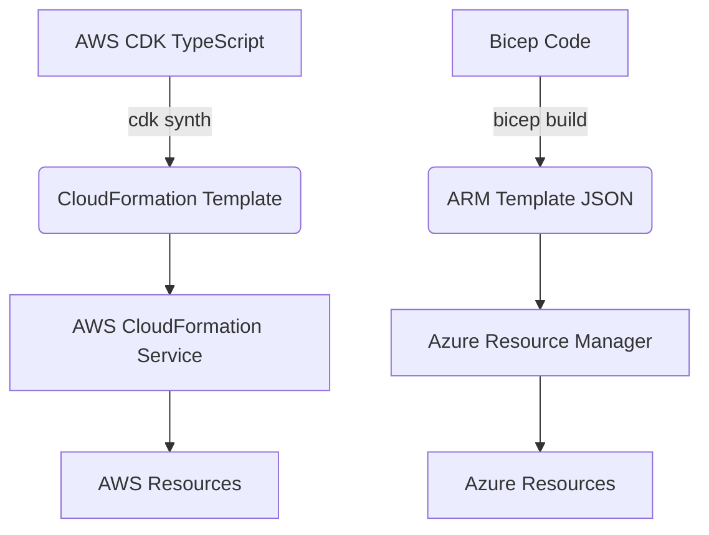

# CloudFormation, AWS CDK, Bicep

## DevOps История (Решение боли)
**Боль:** Универсальные IaC инструменты (Terraform/Pulumi) не всегда успевают за выпуском новых фич облачных провайдеров, и требуют сторонних стейт-файлов, которые нужно обслуживать.
**Решение:** Провайдер-специфичные инструменты (CloudFormation/CDK для AWS, Bicep для Azure) разрабатываются самими вендорами. Они гарантируют "Day 1" поддержку новых сервисов, глубокую интеграцию с экосистемой и хранят состояние (state) прямо внутри облака, избавляя от боли управления стейт-файлами.

## Архитектура и Процесс


## Примеры кода

### AWS CDK (TypeScript)
Высокоуровневая абстракция для генерации CloudFormation:
```typescript
import * as cdk from 'aws-cdk-lib';
import { aws_s3 as s3 } from 'aws-cdk-lib';

export class MyStack extends cdk.Stack {
  constructor(scope: cdk.App, id: string, props?: cdk.StackProps) {
    super(scope, id, props);

    new s3.Bucket(this, 'MyFirstBucket', {
      versioningConfiguration: { status: 'Enabled' }
    });
  }
}
```

### Bicep (Azure)
Легковесная надстройка над ARM:
```bicep
param location string = resourceGroup().location

resource storageAccount 'Microsoft.Storage/storageAccounts@2022-09-01' = {
  name: 'mystorageaccount123'
  location: location
  sku: {
    name: 'Standard_LRS'
  }
  kind: 'StorageV2'
}
```

### Основные команды
```bash
# AWS CDK
cdk bootstrap   # Подготовка окружения
cdk diff        # Сравнение изменений
cdk deploy      # Деплой

# Azure Bicep
az deployment group create \
  --resource-group myRG \
  --template-file main.bicep
```

## Day 2 Operations (Эксплуатация)
- **Управление стейтом:** Стейт управляется самим облаком (CloudFormation Stacks / Azure Deployments). Не нужно настраивать бакеты и блокировки.
- **Drift Detection (AWS):** Регулярный запуск обнаружения дрифтов в консоли CloudFormation для поиска изменений, сделанных руками вне кода.
- **Ограничение прав (Azure):** Использование Azure Policy совместно с Bicep для гарантии того, что создаваемые ресурсы соответствуют корпоративным стандартам безопасности.
- **Обновления:** В CDK часто используются `Constructs` библиотек. Требуется следить за их версионированием и планово обновляться (особенно мажорные версии), так как они генерируют разный CloudFormation код.

## Антипаттерны
- **Правки через консоль (ClickOps):** Из-за провайдер-специфичности, велико искушение быстро поправить ресурс руками в веб-консоли. Это ведет к рассинхронизации и поломкам при следующем деплое.
- **Жесткое привязывание (Vendor Lock-in) при мультиклауде:** Использование CloudFormation, когда компания явно планирует миграцию или разворачивание аналогичной инфраструктуры в GCP/Azure.
- **Писать чистый CloudFormation JSON/YAML руками:** Это боль. Объемные шаблоны трудно читать и поддерживать. Лучше использовать CDK или хотя бы SAM для бессерверных приложений.
