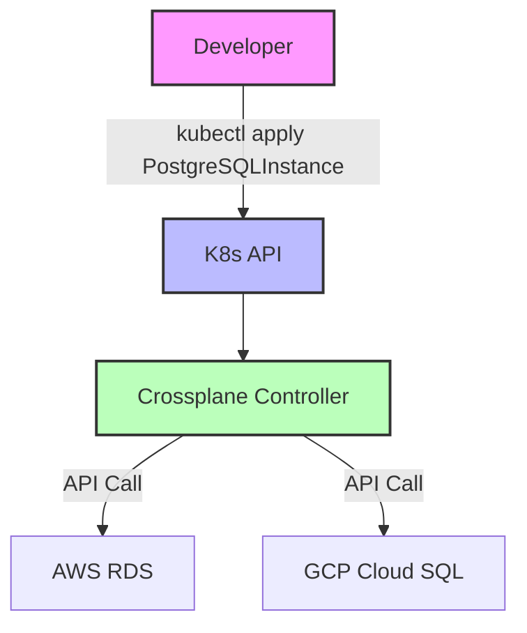

# Crossplane (Control Planes)

## DevOps История (Боль -> Решение)
**Боль:** Разработчикам нужны базы данных (RDS), кэши (Redis) и кластеры, но они не хотят изучать Terraform и ждать инфраструктурную команду. Инженеры инфраструктуры тратят время на ручное выполнение Terraform-скриптов или написание сложных CI/CD пайплайнов для провижининга, что создает "бутылочное горлышко".
**Решение:** Crossplane превращает Kubernetes в универсальный Control Plane. Инфраструктура (AWS, GCP, Azure) описывается как стандартные Kubernetes ресурсы (CRD). Разработчики запрашивают абстрактную базу данных (например, `PostgreSQLInstance`), а Crossplane сам создает нужный RDS в AWS, управляя жизненным циклом ресурса.

## Архитектура


## Примеры

### YAML: Создание провайдера и ресурса
```yaml
# 1. Установка провайдера AWS
apiVersion: pkg.crossplane.io/v1
kind: Provider
metadata:
  name: provider-aws-rds
spec:
  package: xpkg.upbound.io/upbound/provider-aws-rds:v0.40.0

---
# 2. Композитный ресурс (Абстракция для разработчика)
apiVersion: database.example.org/v1alpha1
kind: PostgreSQLInstance
metadata:
  name: my-db
  namespace: my-app
spec:
  parameters:
    storageGB: 20
  compositionSelector:
    matchLabels:
      environment: production
      provider: aws
```

### Bash: Установка и проверка
```bash
# Установка Crossplane через Helm
helm repo add crossplane-stable https://charts.crossplane.io/stable
helm install crossplane crossplane-stable/crossplane --namespace crossplane-system --create-namespace

# Проверка статуса ресурсов
kubectl get managed
kubectl get crossplane
```

## Day 2 Operations (Обслуживание)
* **Drift Detection & Reconciliation:** Crossplane автоматически возвращает инфраструктуру в описанное состояние, если кто-то вручную изменил настройки в консоли облачного провайдера.
* **Обновление провайдеров:** Регулярное обновление пакетов провайдеров (Provider) для поддержки новых фичей облаков.
* **Бэкап стейта:** В отличие от Terraform с его `terraform.tfstate`, стейт хранится в etcd самого Kubernetes. Важно регулярно бэкапить etcd (например, через Velero).
* **Управление секретами:** Crossplane автоматически сохраняет доступы (Connection Secrets) к созданным базам данных в Kubernetes Secrets, откуда их легко монтировать в поды приложений.

## Антипаттерны
* **Использование Crossplane без Compositions:** Создание сырых управляемых ресурсов (Managed Resources) напрямую разработчиками. Это нарушает инкапсуляцию и усложняет код. Всегда используйте `CompositeResourceDefinition (XRD)` и `Composition` для создания простых абстракций для разработки.
* **Перенос монолитных Terraform стейтов "как есть":** Crossplane лучше работает для микросервисной архитектуры и динамически запрашиваемых ресурсов. Не пытайтесь засунуть базовую сеть (VPC, Subnets) в Crossplane, если она статична и меняется редко (тут лучше оставить Terraform).
* **Игнорирование RBAC:** Не давать разработчикам доступ ко всем CRD. Ограничивайте права только на их специфичные Composite Resources, чтобы они не могли случайно удалить чужую инфраструктуру.
