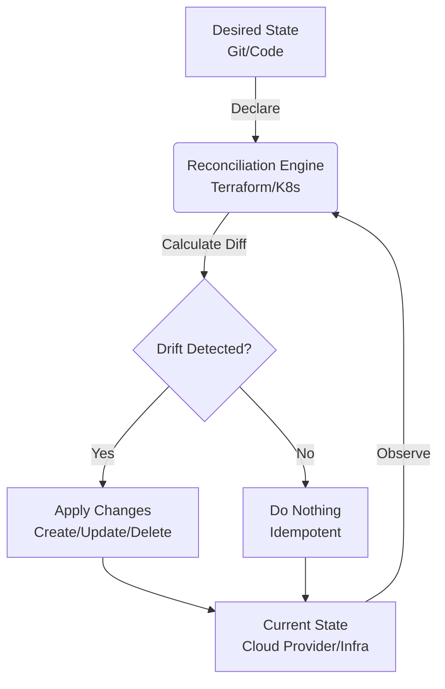

# Idempotency и Desired State

## 📖 История из жизни (Решение боли)
**Боль:** Команда использовала bash-скрипты для настройки серверов. При падении скрипта на середине, повторный запуск приводил к созданию дубликатов пользователей, ошибкам монтирования дисков и конфликтам портов. Администраторам приходилось писать сложные проверки `if [ -f /etc/config ]` для каждого шага.
**Решение:** Переход на концепции **Идемпотентности** (возможность многократного применения без изменения конечного результата после первого успеха) и **Desired State** (описание того, *что* мы хотим получить, а не *как* это сделать). Инструменты IaC (Terraform, Ansible, Kubernetes) сами вычисляют разницу между текущим состоянием и желаемым, применяя только необходимые изменения.

## 📊 Архитектура (Desired State Reconciliation)



## 💻 Примеры

### ❌ Императивный подход (Не идемпотентно)
```bash
# Создание директории. Упадет при повторном запуске, если не добавить -p
mkdir /app/data

# Добавление строки в конфиг. При повторном запуске строка сдублируется
echo "max_connections=100" >> /etc/postgresql.conf
```

### ✅ Декларативный подход (Desired State)
```yaml
# Ansible (Идемпотентно по умолчанию)
- name: Ensure app data directory exists
  ansible.builtin.file:
    path: /app/data
    state: directory
    mode: '0755'

- name: Ensure max_connections is 100
  ansible.builtin.lineinfile:
    path: /etc/postgresql.conf
    line: "max_connections=100"
    regexp: "^max_connections="
```

## 🛠 Day 2 Operations
- **Drift Detection:** Регулярный запуск `terraform plan` или автоматизированных инструментов (например, Terraform Cloud, Atlantis) для выявления "дрейфа" конфигурации (когда кто-то внес изменения руками).
- **Continuous Reconciliation:** В Kubernetes это реализовано на уровне контроллеров — они постоянно сверяют Current State с Desired State и автоматически исправляют отклонения. GitOps (ArgoCD) делает то же самое для целых кластеров.
- **State Management:** Защита файлов состояния (tfstate) от ручного редактирования, использование удаленных бэкендов с блокировками (S3 + DynamoDB).

## ⚠️ Антипаттерны
1. **Смешивание подходов:** Использование `local-exec` или `null_resource` в Terraform для выполнения императивных скриптов, которые не являются идемпотентными.
2. **ClickOps (Ручные изменения):** Внесение правок напрямую через веб-консоль провайдера. Это ломает Desired State, так как код перестает отражать реальность, и при следующем деплое ручные изменения будут затерты.
3. **Игнорирование состояния (State):** Попытки управлять ресурсами без сохранения их текущего состояния, что приводит к пересозданию ресурсов (orphaned resources) вместо их обновления.
