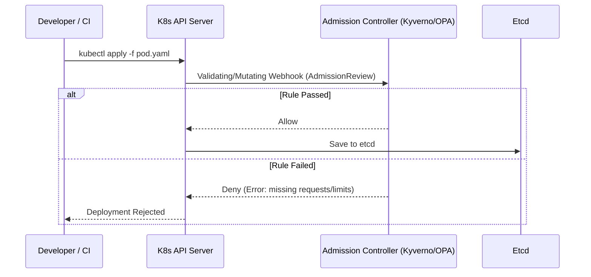

# Policy as Code (OPA, Kyverno)

## DevOps История (Боль -> Решение)
**Боль:** Разработчики деплоят приложения в K8s с привилегированными контейнерами, без лимитов ресурсов (`requests/limits`) или с образами из публичных неавторизованных registry. Инциденты безопасности, OOMKills соседей и перерасход ресурсов становятся нормой, а ручное ревью YAML-манифестов не масштабируется.
**Решение:** Policy as Code (PaC) позволяет автоматически проверять, изменять или блокировать ресурсы до их применения в кластере. OPA (Gatekeeper) или Kyverno работают как Admission Controllers в K8s, гарантируя, что вся инфраструктура всегда соответствует правилам безопасности и корпоративным стандартам.

## Архитектура


## Инструменты
* **Kyverno:** Создан специально для Kubernetes. Политики пишутся на привычном YAML. Умеет валидировать, мутировать и генерировать ресурсы.
* **OPA (Open Policy Agent) Gatekeeper:** Универсальный движок политик. Политики пишутся на специальном языке Rego. Более сложный порог входа, но подходит для интеграции вне K8s (CI/CD, Terraform, API шлюзы).

## Примеры (Kyverno)

### YAML: Валидация (запрет `latest` тега)
```yaml
apiVersion: kyverno.io/v1
kind: ClusterPolicy
metadata:
  name: disallow-latest-tag
spec:
  validationFailureAction: Enforce
  rules:
  - name: require-image-tag
    match:
      resources:
        kinds:
        - Pod
    validate:
      message: "Использование тега latest запрещено. Укажите конкретную версию!"
      pattern:
        spec:
          containers:
          - image: "!*:latest"
```

### Bash: Тестирование политик локально/в CI (Kyverno CLI)
```bash
# Применение политики локально к манифестам перед деплоем
kyverno apply policy.yaml --resource pod.yaml

# Запуск автоматических тестов на набор политик
kyverno test .
```

## Day 2 Operations (Обслуживание)
* **Audit Mode -> Enforce Mode:** Всегда внедряйте новые политики в режиме `Audit` (только логирование нарушений), чтобы не сломать работающий продакшен. Переключайте политику в `Enforce` (блокировку) только после анализа отчетов (Policy Reports) и исправления старых ресурсов.
* **Мониторинг метрик:** Сбор метрик с Admission Webhook (задержки ответа, количество блокировок) в Prometheus, чтобы убедиться, что контроллер политик не стал узким горлышком для K8s API.
* **Исключения (Exceptions):** Грамотное управление исключениями (`PolicyException` в Kyverno) для системных компонентов (например, `kube-system`), которым объективно нужны широкие права, без раздувания самих политик.

## Антипаттерны
* **Слишком сложные политики на Rego (OPA):** Написание нечитаемых скриптов, которые никто в команде, кроме автора, не может отладить или обновить.
* **Мутация манифестов без ведома владельцев:** Использование Mutating Webhooks для неявного изменения манифестов (например, вставка sidecar-контейнеров) без отражения этого в GitOps-репозитории. В GitOps лучше отклонить ресурс и заставить разработчика исправить его явно.
* **Единая точка отказа:** Запуск Admission Controller в одном экземпляре без High Availability (HA). Если под упадет и `failurePolicy` установлен в `Fail` на Webhook'ах, любой деплой в кластер будет заблокирован.
