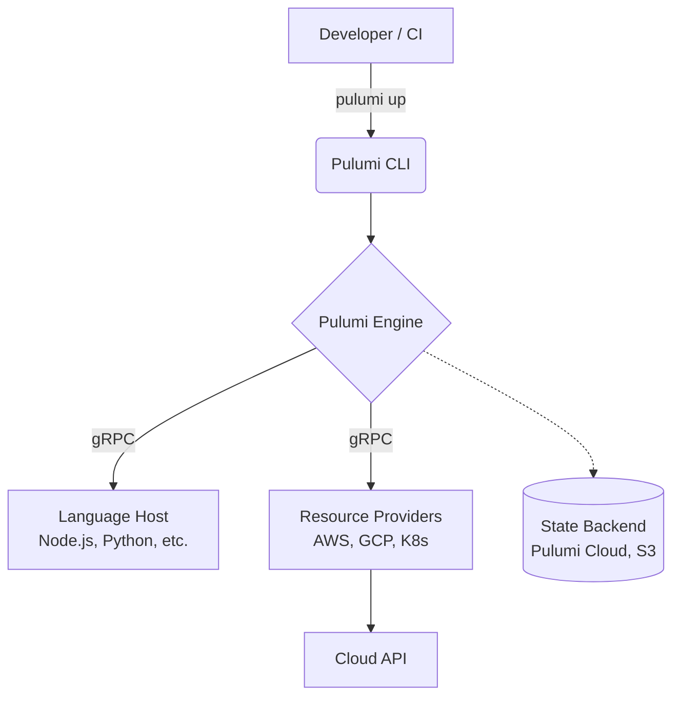

# Pulumi

## DevOps История (Решение боли)
**Боль:** Команды разработчиков хотят описывать инфраструктуру, но не хотят учить предметно-ориентированные языки (HCL) или работать с гигантскими YAML файлами.
**Решение:** Pulumi позволяет использовать знакомые языки программирования (TypeScript, Python, Go, C#) для определения инфраструктуры как кода. Это приносит всю мощь современных IDE (автодополнение, рефакторинг, тестирование) в мир IaC.

## Архитектура и Процесс


## Примеры кода
Развертывание AWS S3 бакета на TypeScript:

```typescript
import * as pulumi from "@pulumi/pulumi";
import * as aws from "@pulumi/aws";

// Создание приватного S3 бакета
const bucket = new aws.s3.Bucket("my-bucket", {
    acl: "private",
    tags: {
        Environment: "Dev",
        Team: "Platform"
    }
});

// Экспорт имени бакета
export const bucketName = bucket.id;
```

Команды управления:
```bash
# Инициализация проекта
pulumi new aws-typescript

# Просмотр планируемых изменений
pulumi preview

# Применение изменений
pulumi up

# Удаление ресурсов
pulumi destroy
```

## Day 2 Operations (Эксплуатация)
- **Управление стейтом:** По умолчанию используется Pulumi Cloud, но для enterprise часто настраивают самописный бэкенд (AWS S3 + DynamoDB для блокировок) через `pulumi login s3://<bucket>`.
- **Интеграция с CI/CD:** Использование GitHub Actions (`pulumi/actions`) с настроенными OIDC-ролями для безопасного деплоя.
- **Дрифты и импорт:** `pulumi refresh` для сверки стейта с реальностью. `pulumi import` для захвата существующих ресурсов под управление.
- **Тестирование:** Unit-тестирование инфраструктуры без обращения к реальному облаку (мокирование провайдеров).

## Антипаттерны
- **Использование слишком большого количества императивной логики:** Хотя это полноценный ЯП, создание 10 000 ресурсов в цикле `for` бездумно может привести к непредсказуемому и трудночитаемому стейту.
- **Хранение секретов в коде:** Встроенный механизм `pulumi config set --secret` позволяет шифровать секреты в стейте; хардкод токенов - серьезная ошибка.
- **Монолитные стеки:** Хранение всей инфраструктуры компании в одном Pulumi-проекте. Лучше разделять на микро-стеки (сеть, базы данных, приложения) с помощью `StackReferences`.
