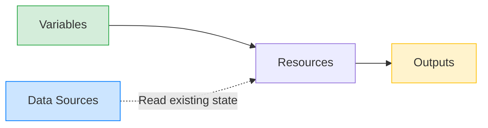

# Data Sources, Variables, Outputs

## 📖 DevOps-история (Решение боли)
**Боль:** Жестко закодированные значения (hardcode) ID сетей, паролей и IP-адресов в коде инфраструктуры не позволяют переиспользовать код для разных окружений (Dev/Stage/Prod).
**Решение:** Использовать переменные (`Variables`) для входных данных, источники данных (`Data Sources`) для динамического получения информации об уже существующей инфраструктуре, и выводы (`Outputs`) для передачи результатов другим модулям или людям.

## 🏗 Архитектура (Mermaid)


## 💻 Примеры (HCL / Bash)

**Пример HCL:**
```hcl
# 1. Variable (Входные данные)
variable "instance_type" {
  description = "Тип инстанса EC2"
  type        = string
  default     = "t3.micro"
}

# 2. Data Source (Чтение существующих данных)
data "aws_ami" "ubuntu" {
  most_recent = true
  owners      = ["099720109477"] # Canonical

  filter {
    name   = "name"
    values = ["ubuntu/images/hvm-ssd/ubuntu-jammy-22.04-amd64-server-*"]
  }
}

# Использование
resource "aws_instance" "web" {
  ami           = data.aws_ami.ubuntu.id
  instance_type = var.instance_type
}

# 3. Output (Выходные данные)
output "server_ip" {
  description = "Публичный IP-адрес сервера"
  value       = aws_instance.web.public_ip
}
```

**Передача переменных (Bash/YAML):**
```bash
# Через аргументы CLI
terraform apply -var="instance_type=t3.large"

# Через переменные окружения (префикс TF_VAR_)
export TF_VAR_instance_type="t3.medium"
terraform apply
```

*Пример `terraform.tfvars`:*
```yaml
# Несмотря на расширение, синтаксис HCL/JSON
instance_type = "t3.xlarge"
db_password   = "SuperSecret123!" # (Только не в Git!)
```

## 🛠 Day 2 Operations (Эксплуатация)
- **Управление секретами:** Чувствительные переменные (пароли) следует помечать флагом `sensitive = true` в блоке `variable` и `output`, чтобы они не печатались в консоль при `terraform plan/apply`. Передавать их лучше из систем управления секретами (Vault) или CI/CD.
- **Обмен данными между State-файлами:** Использование `terraform_remote_state` как `data source` позволяет одному проекту читать `outputs` другого (например, проект приложения читает ID VPC из проекта сети).
- **Валидация вводов:** Использование блока `validation {}` внутри `variable` для предотвращения ошибок пользователя еще на этапе плана.

## 🚫 Антипаттерны
- **Слишком много переменных:** Превращение каждого параметра в переменную усложняет использование модуля. Оставляйте разумные `default` значения.
- **Использование Data Sources для ресурсов, управляемых в том же state:** Если ресурс создается здесь же, ссылайтесь на него напрямую (`aws_instance.web.id`), а не через `data`.
- **Хранение секретов в tfvars:** Коммит файлов `terraform.tfvars` с паролями в репозиторий. Используйте SOPS или инжектируйте переменные в CI пайплайне.
