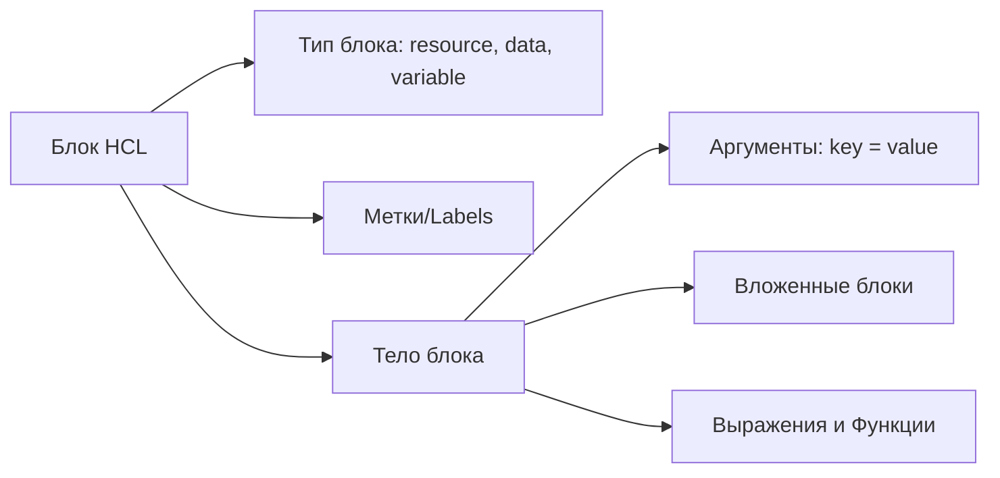

# HashiCorp Configuration Language (HCL)

## 📖 DevOps-история: Решение боли

**Боль:** Попытки описывать сложную инфраструктуру в JSON приводили к нечитаемым "портянкам" кода без комментариев. YAML спасал ситуацию с читаемостью, но в нем отсутствовала встроенная логика (циклы, условия, ссылки на другие блоки), что заставляло писать громоздкие скрипты-обертки для шаблонизации (вроде Jinja2 поверх YAML).

**Решение:** Разработка **HCL**. Он объединил читаемость YAML (и даже лучше) с мощностью строго типизированного языка. HCL позволил использовать переменные, функции, условия и циклы прямо в конфигурации, делая IaC по-настоящему выразительным и удобным для инженеров.

## 🏗 Структура языка



## 🛠 Примеры

### HCL: Основные конструкции
```hcl
# Блок локальных переменных
locals {
  team_name = "devops"
  tags = {
    Owner = local.team_name
    ManagedBy = "Terraform"
  }
}

# Входная переменная
variable "instance_count" {
  type    = number
  default = 2
}

# Ресурс с использованием циклов (count) и функций
resource "aws_instance" "app" {
  count         = var.instance_count
  ami           = data.aws_ami.ubuntu.id
  instance_type = "t3.micro"

  tags = merge(local.tags, {
    Name = "AppServer-${count.index + 1}"
  })
}
```

## 🌅 Day 2 Operations (Обслуживание)

1. **Рефакторинг кода (Блок `moved`):**
   - Начиная с Terraform 1.1, перемещение ресурсов между модулями или переименование делается декларативно через блок `moved`, без необходимости использовать опасные команды `terraform state mv`.
   ```hcl
   moved {
     from = aws_instance.web
     to   = module.web_servers.aws_instance.this
   }
   ```
2. **Работа с большими структурами данных:**
   - Использование функций `for`, `for_each`, и `flatten` для преобразования сложных JSON-ответов от API (через data sources) в удобные карты (maps) для создания ресурсов.
3. **Валидация:**
   - Использование блоков `validation` внутри `variable` для ограничения допустимых значений на раннем этапе (например, проверка формата IP-адреса с помощью `regex()`).

## 🚫 Антипаттерны

- ❌ **Злоупотребление `dynamic` блоками:** Создание слишком сложной логики внутри `dynamic`, которая делает код нечитаемым. Если HCL становится похож на спагетти-код из-за `dynamic`, лучше вынести логику в отдельный модуль или пересмотреть подход.
- ❌ **Использование `count` вместо `for_each` для списков:** Если удалить элемент из середины списка при использовании `count`, Terraform пересоздаст все последующие ресурсы. Используйте `for_each` с `map` или `set` строк.
- ❌ **Дублирование значений:** Отказ от использования `locals` для переиспользуемых значений (например, префиксов имен, общих тегов), что усложняет глобальные изменения.
- ❌ **Отсутствие типов:** Объявление `variable` без указания `type`. Строгая типизация — сильная сторона HCL, помогающая избежать ошибок.
