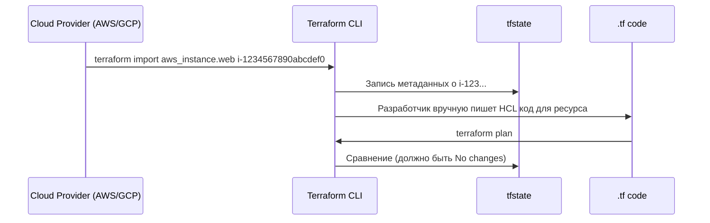

# Terraform Import и Lifecycle

## 📖 История: Боль и Решение
**Боль:** Часть инфраструктуры уже была создана "руками" через веб-консоль (ClickOps). Как теперь описать её в коде, не пересоздавая? Другая проблема — кто-то случайно выполнил `terraform destroy` и удалил критичную базу данных.
**Решение:** **`terraform import`** для захвата существующих ресурсов в стейт и **блок `lifecycle`** для защиты от случайных изменений/удалений.

## 🏗 Архитектура (Процесс импорта)



## 💻 Примеры

**Bash: Импорт ресурса**
```bash
# Формат: terraform import <TF_RESOURCE_NAME> <CLOUD_ID>
terraform import aws_s3_bucket.my_bucket my-existing-bucket-name
```
*Примечание: в новых версиях Terraform (>= 1.5) появился блок `import {}`, который позволяет импортировать ресурсы прямо из кода, без CLI.*

**Terraform: Блок `import` (современный подход)**
```hcl
import {
  to = aws_s3_bucket.my_bucket
  id = "my-existing-bucket-name"
}
```

**Terraform: Блок `lifecycle`**
Защищаем важные ресурсы:
```hcl
resource "aws_db_instance" "prod_db" {
  allocated_storage = 100
  engine            = "postgres"
  instance_class    = "db.t3.large"

  lifecycle {
    prevent_destroy = true # Защита от terraform destroy
    ignore_changes  = [
      tags, # Игнорировать изменения тегов (например, если они ставятся внешним инструментом)
    ]
  }
}
```

## 🛠 Day 2 Operations
- **Регулярный Drift Detection:** Ресурсы, импортированные в стейт, могут быть изменены вручную. Настройте пайплайн, который регулярно запускает `terraform plan` в режиме readonly, чтобы обнаруживать расхождения (drift) между кодом и реальностью.
- **Обновление `ignore_changes`:** По мере того как автоматизация (например, Kubernetes Controllers или AWS AutoScaling) начинает управлять атрибутами ресурсов (количество реплик, конкретные AMI), добавляйте их в `ignore_changes`.

## 🚫 Антипаттерны
- **Частое использование `ignore_changes` для всего подряд:** Если вы игнорируете почти все атрибуты ресурса, теряется смысл IaC. Ищите первопричину изменения стейта.
- **Импорт без написания кода:** Если сделать `terraform import`, но забыть описать ресурс в `.tf` файле, следующий же `terraform apply` попытается удалить этот ресурс, так как его нет в конфигурации.
- **Слепая вера в `prevent_destroy`:** Этот флаг защищает только от Terraform. Он не спасет, если кто-то удалит ресурс через консоль AWS или если удалить ресурс из стейта командой `terraform state rm`.
